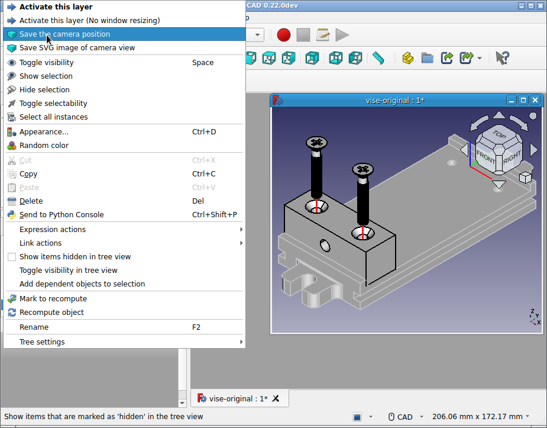

#  OSH Automated Documentation

## Introduction

OSH Automated Documentation is software that allows you to generate high-quality visual assembly instructions for physical products designed in CAD software. It consists of two parts, this FreeCAD workbench and a compiler for generating PDF files. For more information see the [OSH Automated Documentation website](https://osh-autodoc.org). This page mainly discusses the workbench that is available in the FreeCAD Addon Manager.

## Overview

This software originates from a [peer-reviewed article](https://openhardware.metajnl.com/articles/10.5334/joh.56) and as such still research software and not production ready. By popular demand we are actively searching for funding to continue this work and make it production ready.

## Usage

The software consists of a **workbench** and a **compiler** that generates a PDF based on a textual description of the manual. The workbench is used to make annotations to the CAD model, for example a STEP file. An example of such an annotation is in the figure below where the camera position is saved to for generating a high-quality image for in the manual:

  

The workbench generates a directory structure with SVG images and a BOM of the parts used for an assembly step. The BOM is a CSV file with images for each part. This output can be used by other software, and in particular or compiler uses it to create PDF images.

The interface between our compiler and workbench has been designed such that the output of the workbench can be used for other workflows as well.

For more information on how to use the workbench, please visit the [OSH Automated Documentation website](https://osh-autodoc.org).

---
⏵ [documentation index](../README.md) > [User_Documentation](Category_User_Documentation.md) > [External_Workbenches](Category_External_Workbenches.md) > OSH Automated Documentation
