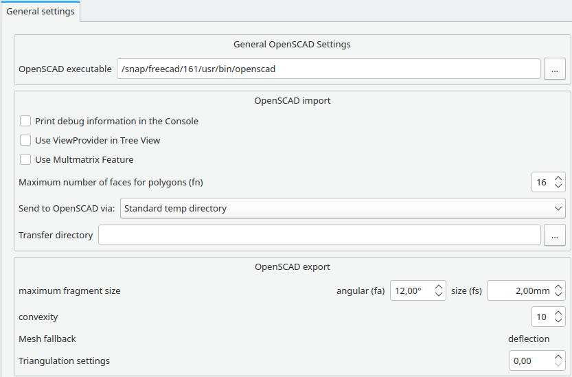

# OpenSCAD Preferences
The preferences screen of the [OpenSCAD Workbench](OpenSCAD_Workbench.md) are found in the [Preferences Editor](Preferences_Editor.md), **Edit → Preferences → OpenSCAD**.

There is only one tab: General settings.

## General settings 

 {{OpenSCAD Tools navi}} 

[ Preferences](Category_Preferences.md)

---
[documentation index](../README.md) > [Preferences](Category_Preferences.md) > [OpenSCAD](OpenSCAD_Workbench.md) > OpenSCAD Preferences
