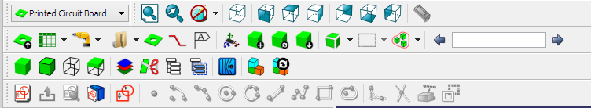
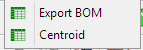
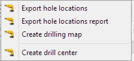
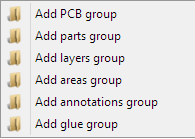
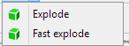
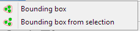

# PCB Workbench

 

## Introduction

 

[Printed Circuit Board](https://en.wikipedia.org/wiki/Printed_circuit_board) Workbench for FreeCAD (PCB)

Flexible Printed Circuit Board Workbench for FreeCAD (FPCB)

Module allows you to import/create PCB boards in FreeCAD. Scope of module:

-   support for many different layers,
-   possible to choose colours, transparency and names for each layer,
-   module allows you to import IGES/STP models with colours,
-   possible to show holes/vias independent.

## References

-   Author: marmni
-   Home page: <https://sourceforge.net/projects/eaglepcb2freecad/>
-   Source code on github: <https://github.com/marmni/FreeCAD-PCB>

## Tools

For detailed workbench use description see **index.pdf** in the source code or [manual](https://raw.githubusercontent.com/marmni/FreeCAD-PCB/master/index.pdf)

Toolbar

Drop down menu

    

## Installation

### Automatic installation 

This workbench can be installed from the [Addon Manager](Std_AddonMgr.md).

### From GitHub 

**Prerequisites**

FreeCAD-PCB requires FreeCAD in version 0.18 or higher and Python version 2.7 or higher.

**Linux Installation Instructions** (From GitHub)

Unpack downloaded zip file and copy extracted folder to directory where FreeCAD is installed (subfolder Mod).

Example:

-   FreeCAD path:

~/Programs/FreeCAD

-   So copy mod to folder

~/Programs/FreeCAD/Mod

-   You can also copy files to folder

~/.FreeCAD/Mod .

-   Next change read/write permission to 777. Please don\'t forget about parameter -R!

Example:

chmod 777 -R PCB

**Windows Installation Instructions** (From GitHub)

Unpack downloaded zip file and copy extracted folder to direction where FreeCAD is installed (subfolder Mod).

Example:

-   FreeCAD path:

C:/Program Files/FreeCAD-0.18

-   So copy mod to folder

C:/Program Files/FreeCAD-0.18/Mod

-   Next change read/write permission for all users. Click right button on folder PCB and choose Properties →

Security → Edit → Users and mark all checkboxes under \'Allow\' option.

**MacOS Installation Instructions** (From GitHub)

## Links to FreeCAD-PCB WB 

-   Workbench Wiki: [External Workbenches](https://wiki.freecadweb.org/External_workbenches)
-   FreeCAD Wiki: [Wiki Main Page](https://wiki.freecadweb.org/Main_Page)
-   FreeCAD Forum: [EaglePCB importer for FreeCAD](http://forum.freecadweb.org/viewtopic.php?f=9&t=5107)
-   Tutorials:
-   Videos: [EaglePCB\_2\_FreeCAD - FreeCAD odczyt plików brd z programu Eagle](https://www.youtube.com/watch?v=81NsljRJx8c&feature=youtu.be)
-   Files: [PCB library](https://github.com/marmni/FreeCAD-PCB-library)
-   Report bugs: Please report bugs at <https://github.com/marmni/FreeCAD-PCB/issues>

## Other useful links 

-   [EaglePCB on sourceforge](https://sourceforge.net/projects/eaglepcb2freecad/)
-   [Macros recipes](Macros_recipes.md)
-   [FreeCAD Download](Download.md)
-   [FreeCAD Community Portal](FreeCAD_Community_Portal.md)

 

[Category:Sandbox](Category:Sandbox.md) [Category:User Documentation](Category:User_Documentation.md) [Category:Addons](Category:Addons.md) [Category:External Workbenches](Category:External_Workbenches.md)
