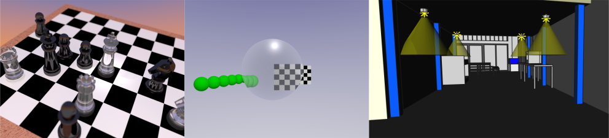
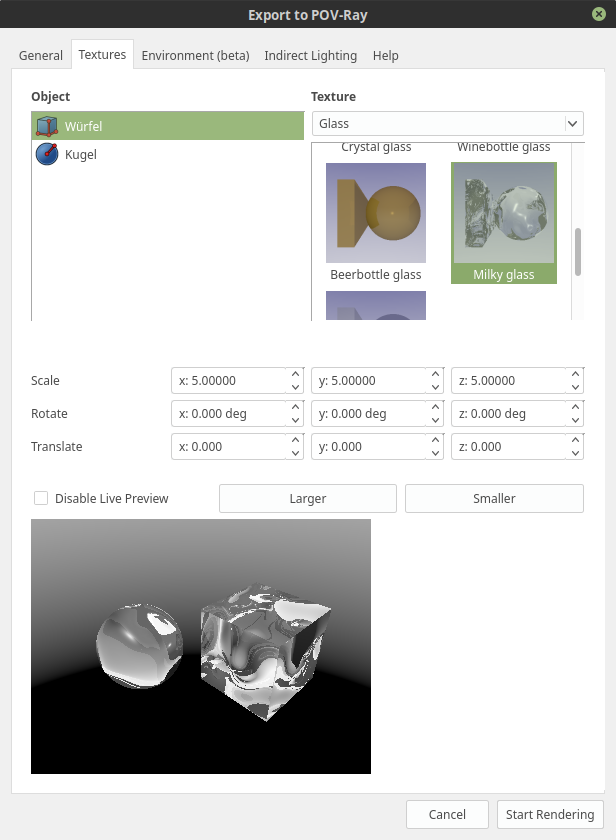
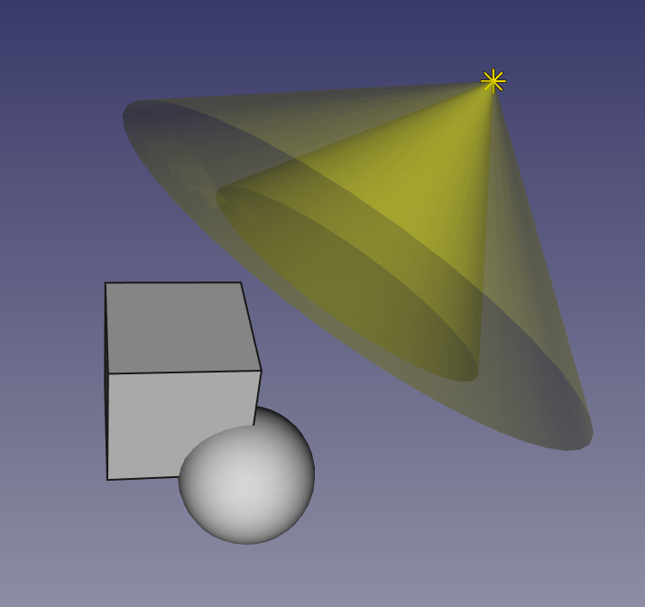
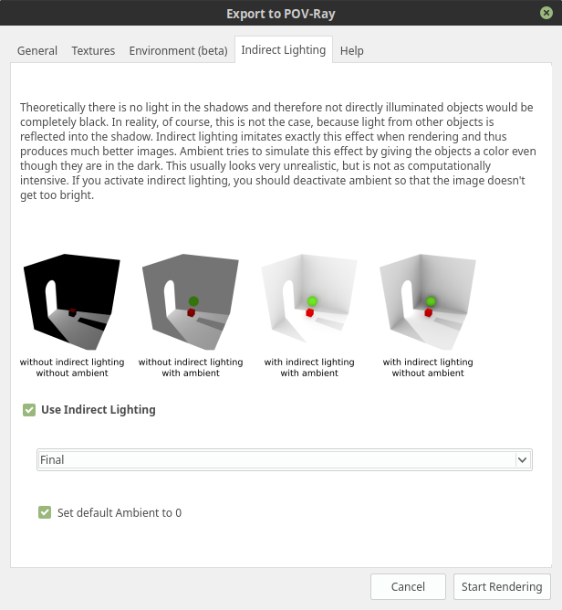
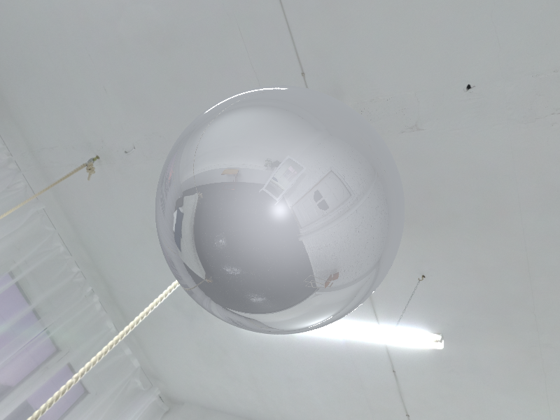
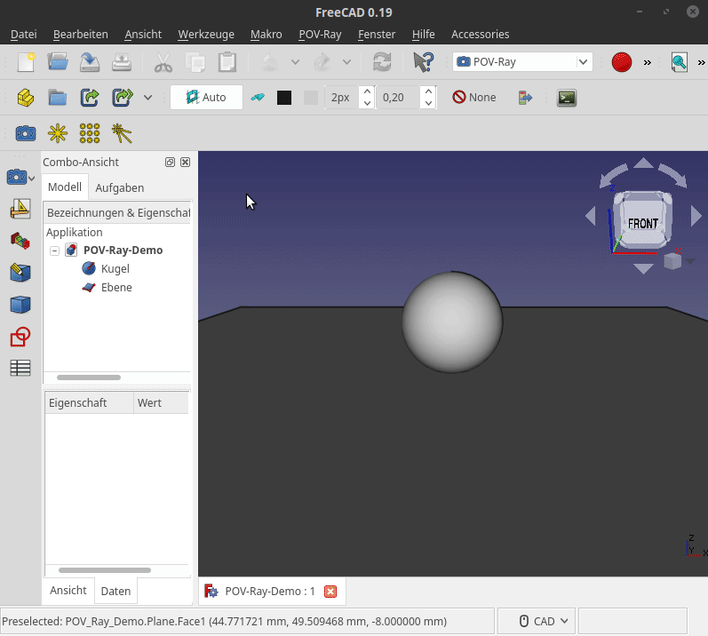
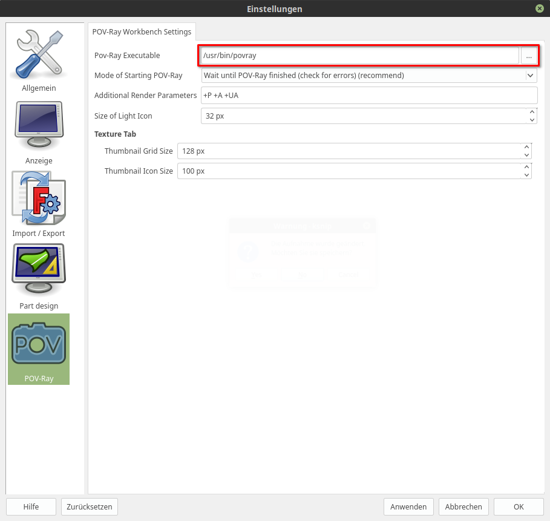

  {{UnfinishedDocu}}

## Introduction

{{TOCright}}

The POV-Ray-Rendering Workbench is an [external workbench](external_workbenches.md) which is built to create renderings easily but also offering advanced options for advanced users.

## Features

### Applying Textures 

There are more than 100 predefined textures you can apply easily or define your own materials.

#### Thumbnails and Live Preview 

You can check the appearance of the material/texture with the pre-rendered thumbnails of the textures. If you want to see the impact of changed options of the texture, you can use the live preview that renders the chosen texture and the options to fine tune the material.

### Lightning

With the three light types area light, point light, spot light and their different options, you can create advanced lightnings to create the convenient atmosphere of the picture.

#### Indirect Lightning (GI) 

The workbench has the option to enable indirect lightning to create more realistic images.

### HDRI Environments 

With the support for HDRI environments, beautiful environments are simple to use:

### User Inc File 

The user has the option to use an extra file what offers the option to use *all* options of the renderer. For more details, checkout our wiki: [Power User](https://gitlab.com/usbhub/exporttopovray/-/blob/master/doc/PowerUser.md)

## Usage

It\'s a lot easier to watch this simple demo of the workbench instead of describing it:

There are many more options in the other tabs you can explore by yourself, or look into our wiki: [Workbench Wiki](https://gitlab.com/usbhub/exporttopovray/-/tree/master/doc)

## Installation

This workbench can be easily installed and updated from the  [Addon Manager](Addon_Manager.md) available in <small>(v0/17)</small> . This workbench is part of FreeCAD\'s [External workbenches](External_workbenches.md). After the workbench is installed, the renderer in the background, POV-Ray, must be installed. How to do this is described here: <http://wiki.povray.org/content/HowTo:Install_POV>

Finally the path to the POV-Ray installation has to be defined in the workbench settings:

## Tools

Almost every setting, except the settings of the light objects, is done in the dialog, so there are not many commands:

-    [OpenDialog](POV-Ray-Rendering_Dialog.md): Open the Dialog where you can apply textures, add HDRI environments, etc. and start the rendering
-    [Point Light](POV-Ray-Rendering_Dialog.md): Insert a Point Light
-    [Area Light](POV-Ray-Rendering_Dialog.md): Insert an Area Light
-    [Spot Light](POV-Ray-Rendering_Dialog.md): Insert a Spot Light

## References

-   Authors
    -   Usb Hub: <https://gitlab.com/usbhub>
    -   DerUhrmacher: <https://gitlab.com/DerUhrmacher>
-   Source code on GitHub: <https://github.com/TheRaytracers/freecad-povray-render>

## Links to POV-Ray Workbench 

-   Workbench Wiki: <https://gitlab.com/usbhub/exporttopovray/-/tree/master/doc>
-   FreeCAD Wiki: XXX
-   FreeCAD Forum: <https://forum.freecadweb.org/viewtopic.php?f=9&t=48629>
-   Report bugs: Please report bugs at GitHub or FreeCAD Forum

## Other useful links 

-   [External workbenches](External_workbenches.md)

[Category:Addons](Category:Addons.md)
