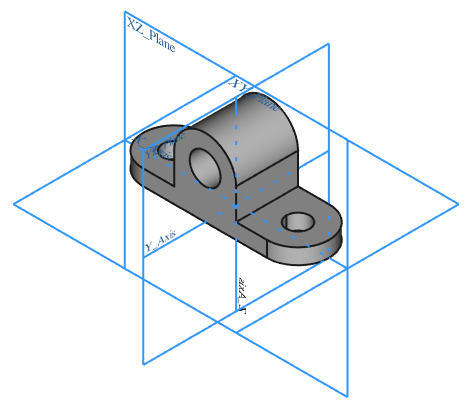
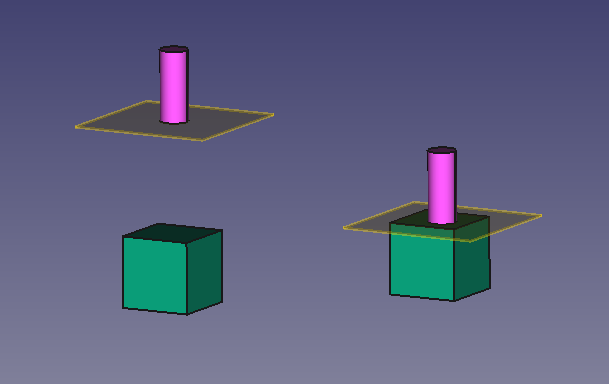
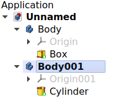
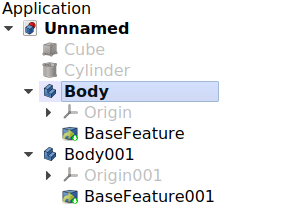
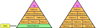
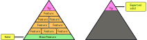
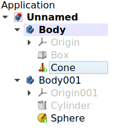
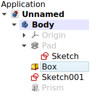
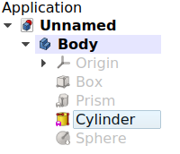

---
- GuiCommand:
   Name:PartDesign Body
   MenuLocation:Part Design → Create body
   Workbenches:[PartDesign](PartDesign_Workbench.md)
   Version:0.17
   SeeAlso:[Std Part](Std_Part.md), [Feature editing](Feature_editing.md)
---

## Description

A [PartDesign Body](PartDesign_Body.md) is the base element to create solids shapes with the [PartDesign Workbench](PartDesign_Workbench.md). It can contain [sketches](Sketch.md), [datum objects](Datum.md), and [PartDesign Features](PartDesign_Feature.md) that help in building a [single contiguous solid](PartDesign_Body#Single_contiguous_solid.md).

The Body provides an **Origin** object which includes local X, Y, and Z axes, and standard planes. These elements can be used as references to attach [sketches](Sketch.md) and [primitive objects](PartDesign_CompPrimitiveAdditive.md).

Do not confuse the  [PartDesign Body](PartDesign_Body.md) with the  [Std Part](Std_Part.md). The first one is a specific object used in the  [PartDesign Workbench](PartDesign_Workbench.md), intended to model a [single contiguous solid](PartDesign_Body#Single_contiguous_solid.md) by means of [PartDesign Features](PartDesign_Feature.md). The [Std Part](Std_Part.md) is a grouping object intended to create [assemblies](assembly.md); it is not used for modelling, just to arrange different objects in space. Multiple bodies, and other [Std Parts](Std_Part.md), can be placed inside a single [Std Part](Std_Part.md) to create a complex assembly.

    *Left: the tree view showing the features that sequentially produce the final shape of the object. Right: the final object visible in the [3D view](3D_view.md).*

## Usage

If no previous solid is selected:

1.  Press the ** [Body](PartDesign_Body.md)** button. An empty Body is created and automatically becomes **[active](PartDesign_Body#Active_status.md)**.
2.  Now you can press **  [Pad](PartDesign_Pad.md)**.
3.  Alternatively, add a primitive  [Additive box](PartDesign_AdditiveBox.md)**.

If a solid object is selected:

1.  Press the ** [Body](PartDesign_Body.md)** button. A new Body is created containing a single **Base Feature**. This Base Feature element is a simple reference to another object previously created or imported into the document. See [Base Feature](PartDesign_Body#Base_Feature.md) for more information. An existing Body or [PartDesign Feature](PartDesign_Feature.md) cannot be selected when pressing ** [Body](PartDesign_Body.md)**.

### Notes

-   If no Body currently exists when **  [New sketch](PartDesign_NewSketch.md)**.
-   Double-click the Body in the [tree view](tree_view.md) or open the context menu (right-click) and select **Toggle active body** to activate or deactivate the Body. If another Body is active, it will be deactivated. See [active status](PartDesign_Body#Active_status.md) for more information.

## Properties

A [PartDesign Body](PartDesign_Body.md) (`PartDesign::Body` class) is derived from a [Part Feature](Part_Feature.md) (`Part::Feature` class), therefore it shares all the latter\'s properties.

In addition to the properties described in [Part Feature](Part_Feature.md), the PartDesign Body has the following properties in the [property editor](property_editor.md).

### Data


{{TitleProperty|Base}}

-    **Tip|Link**: the [PartDesign Feature](PartDesign_Feature.md) defined as \"Tip\", which is usually the last feature created in the Body. The Tip indicates the final shape of the Body, which is shown in the [3D view](3D_view.md) when **Display Mode Body** is set to `Tip`. See [Tip](PartDesign_Body#Tip.md) for more information.

-    **Base Feature|Link**: an external shape used as the first [PartDesign Feature](PartDesign_Feature.md) in the Body. It is usually set when dragging a solid object into an empty Body. If no solid is imported in this way, this property will be empty. See [Base Feature](PartDesign_Body#Base_Feature.md) for more information.

-    **Placement|Placement**: the position of the object in the [3D view](3D_view.md). The placement is defined by a `Base` point (vector), and a `Rotation` (axis and angle). See [Placement](Placement.md).

-    **Group|LinkList**: a list with the [PartDesign Features](PartDesign_Feature.md) in the Body.

#### Hidden properties Data 

-    **Origin|Link**: the [App Origin](App_Origin.md) object that is the positional reference for all elements listed in **Group**.

-    **_ Group Touched|Bool**: whether the group is touched or not.

Also the hidden properties described in [Part Feature](Part_Feature.md).

### View


{{TitleProperty|Base}}

-    **Display Mode Body|Enumeration**: sets the display mode specifically for the Body with one of two types.

    -   
        `Through`
        
        (default) exposes all objects inside the Body, that is, [sketches](Sketch.md), [PartDesign Features](PartDesign_Feature.md), datum objects, etc. This mode allows visualizing partial operations done inside the Body, and thus it is the recommended mode when adding and editing features. Select the specific feature, and the set **Visibility** to `True` or press the **Space** bar on the keyboard.

    -   
        `Tip`
        
        exposes only the final shape of the Body, which is defined by the **Tip** property. Everything else, including [sketches](Sketch.md), [partial features](PartDesign_Feature.md), datums, etc., is not displayed, even if they are visible in the [tree view](tree_view.md). This mode is recommended when the Body does not need to be modified further, so a fixed shape is shown. This mode is also recommended when you wish to select the sub-elements (vertices, edges, and faces) of the final shape to use with other workbenches\' tools.

## Body concept 

### Single contiguous solid 

A PartDesign Body is intended to model a single contiguous solid. The meaning of \"contiguous\" is an element made in one piece, with no moving parts, or disconnected solids. Examples of contiguous solids are those that are manufactured from a single piece of raw material by a process of casting, cutting, or milling. For example, a nut, a washer, and a bolt each consists of a single solid piece of steel with no moving parts, so each can be modelled by a PartDesign Body. Objects that are created by welding two pieces can also be modelled by a single Body as long as the weld joint is not intended to break apart.

Once these contiguous solids are put together in some type of arrangement, then they become an \"assembly\". In an assembly, the objects are not fused together, but they are simply \"stacked\" or placed next to each other, and remain individual parts.

    
*Left: three individual contiguous solids, each of them modelled by a PartDesign Body. Right: the individual Bodies put together in an assembly.*

### Feature editing 

A PartDesign Body is intended to work by creating an initial solid, either from a [sketch](Sketch.md) or from a [primitive shape](PartDesign_CompPrimitiveAdditive.md), and then modifying it through [\"features\"](PartDesign_Feature.md) to add or remove material from the previous shape. For a full explanation go to [feature editing](feature_editing.md).

A PartDesign Body will perform an automatic [fusion](Part_Fuse.md) (union) of the solid elements inside of it. This means that (1) partial solids should be touching when created, and (2) disconnected solids are not allowed.

    
*Left: two individual solids that intersect each other. Right: a single PartDesign Body with two [additive features](PartDesign_Feature.md); they are automatically fused together, so instead of intersecting, they form a single contiguous solid.*

   *Left: two disconnected solids; this isn't a valid PartDesign Body. Right: two touching solids; this results in a valid PartDesign Body. The newer [feature](PartDesign_Feature.md) should always contact or intersect the previous feature so that it is fused to it, and becomes a single contiguous solid.*


**Note:**

other CAD programs like Catia allow discontiguous solids in the same \"Body\". As of v0.19, FreeCAD does not allow this. There has been discussions in the [FreeCAD forum](https://forum.freecadweb.org/index.php) about lifting this restriction but no concrete decision has been made. If you\'d like to know more or present different points of view, please discuss in the [forum](https://forum.freecadweb.org/index.php).

## Detailed explanation of the properties 

### Active status 

An open document can contain multiple Bodies. To add a new feature to a specific Body, it needs to be made **active**. An active body will be displayed in the [tree view](tree_view.md) with the background color specified by the **Active container** value in the [preferences editor](Preferences_Editor#Colors.md) (by default, light blue). An active body will also be shown in bold text.

To activate or de-activate a Body:

-   Double click on it on the [tree view](tree_view.md), or
-   Open the context menu (right click) and select **Toggle active body**.

Activating a Body automatically switches to the [PartDesign Workbench](PartDesign_Workbench.md). Only a single Body can be active at a time.

  


*Document with two PartDesign Bodies, of which the second one is active.*

### Origin

The Origin consists of the three standard axes (X, Y, Z) and three standard planes (XY, XZ and YZ). [Sketches](Sketch.md) and other objects can be attached to these elements when creating them.

1.  Create the Body.
2.  If the Body is selected in the  [New sketch](PartDesign_NewSketch.md)**; the [task panel](task_panel.md) will open to allow selecting one of the planes.
3.  If the Body is not selected, select the Origin instead and make it visible in the [3D view](3D_view.md) by pressing the **Space** bar in the keyboard. Also expand the Origin object to see the axes and planes.
4.  Select one of the planes, either in the  [New sketch](PartDesign_NewSketch.md)**. The sketch will be created on the chosen plane.

The same process can be used when creating auxiliary datum geometry like [PartDesign Lines](PartDesign_Line.md), [PartDesign Planes](PartDesign_Plane.md), and [PartDesign CoordinateSystems](PartDesign_CoordinateSystem.md).


**Note:**

the Origin is an [App Origin](App_Origin.md) object (`App::Origin` class), while the axes and planes are objects of type `App::Line` and `App::Plane` respectively. Each of these elements can be hidden and unhidden individually with the **Space** bar; this is useful to choose the correct reference when creating other objects.


**Note 2:**

all elements inside the Body are referenced to the Body\'s Origin which means that the Body can be moved and rotated in reference to the global coordinate system without affecting the placement of the elements inside.

  


*Left: PartDesign Body Origin in the [tree view](tree_view.md). Right: representation of the Origin elements in the [3D view](3D_view.md).*

### Base Feature 

The Base Feature is the first [PartDesign Feature](PartDesign_Feature.md) in the Body when the Body is based on another solid shape. This solid can be created by any workbench, or imported from an external file, for example, a STEP file.

   *PartDesign Bodies, each of them with a single Base Feature, which are taken from previously created solids.*

To create the Base Feature:

1.  select a solid shape external to any Body, and
2.  press ** [Body](PartDesign_Body.md)**; this will create a new Body with a single Base Feature.


**Note:**

you can\'t select an existing Body, or any of its  [Body](PartDesign_Body.md)**.

If you already have a Body, you can create the Base Feature in this way:

-   in the [tree view](tree_view.md), pick an object, and drag and drop it inside the Body, or
-   in the [property editor](property_editor.md), edit the value of **Base Feature** by pressing the ellipsis **...**, and choosing an object from the list. In this case you can choose an existing Body to be the Base Feature.


**Note:**

dragging and dropping only works for Bodies which don\'t have a Base Feature already.


**Note 2:**

if the Body already has several features, when you drag and drop the external solid, the Base Feature will be created at the beginning of the list of features, that is, it will be added to the beginning of the **Group** property.

The Base Feature is entirely optional; it is only present when including an object from outside the Body. If no external solid is included, you can still build your shape using [sketches](Sketch.md), [pads](PartDesign_Pad.md), [primitive objects](PartDesign_CompPrimitiveAdditive.md), and other [PartDesign Features](PartDesign_Feature.md). In this case the **Base Feature** property remains empty.




*Left: PartDesign Body with a Base Feature that is taken from an external solid object, and many subsequent [PartDesign Features](PartDesign_Feature.md) on top. Right: Body which doesn't have an explicit Base Feature.*

### Tip

The Tip is the   [Part Cut](Part_Cut.md)**) needs to use the shape of the Body, it will use the shape of the Tip. Said in another way, the Tip is the final representation of the Body as if the parametric history didn\'t exist.




*Left: PartDesign Body with full parametric history including intermediate features. Right: the Tip is the final shape that can be exported from the Body, while omitting the model's history.*

The Tip is automatically set to the last feature created in the Body. Nevertheless, it can also be set to any of the intermediate features by opening the  [Set tip](PartDesign_MoveTip.md)**, or by changing the Body\'s **Tip** value in the [property editor](property_editor.md).

Changing the Tip in effect rolls back its history, making it possible to add features that should have been added earlier. It also exposes a different shape to external tools.

In the [tree view](tree_view.md), the Tip of the Body is recognized by the [PartDesign Feature](PartDesign_Feature.md) that has an icon overlay consisting of a white arrow inside a green circle.

   *Two PartDesign Bodies, each of them with [PartDesign Features](PartDesign_Feature.md). The Tip is the last feature in them, and is marked with an overlay symbol.*

### Interaction with other workbenches 

By default, [PartDesign Features](PartDesign_Feature.md) inside a Body are selectable, as this is required to edit and add more features with the [PartDesign Workbench](PartDesign_Workbench.md) tools. Nevertheless, selecting the individual features to use them with tools from other workbenches, like [Part](Part_Workbench.md) and [Draft](Draft_Workbench.md), is not advised, as the results may be unexpected; if this is done, in the [report view](Report_view.md) an error message may appear, **Links go out of the allowed scope**.

Therefore, for interactions with other workbenches, only the Body itself should be selected in the [tree view](tree_view.md). In cases where it is necessary to select specific sub-elements of the Body (vertices, edges, and faces), the Body\'s **Display Mode Body** property should be switched to `Tip`. When this mode is enabled, access to objects under the Body ([features](PartDesign_Feature.md), datums, [sketches](Sketch.md)) is disabled, and everything but the Body\'s [Tip](PartDesign_Body#Tip.md) will be hidden in the [3D view](3D_view.md).

Once the sub-elements have been used with other workbenches, **Display Mode Body** can be set back to `Through`.


*Left: when "Display Mode Body" is set to `Through* it is possible to select and perform operations with the individual [PartDesign Features](PartDesign_Feature.md); in general, this is not recommended. Right: when "Display Mode Body" is set to {{incode|Tip` all selections and operations done on the Body will be done on the Tip, making sure only the final shape of the Body is exposed.}}

### Visibility management 

The Body\'s visibility supersedes the visibility of any object it contains. If the Body is hidden, the objects it contains will be hidden as well, even if their individual **Visibility** property is set to `True`.

Multiple [Sketches](Sketch.md) may be visible at one time, but only one [PartDesign Feature](PartDesign_Feature.md) (solid result) can be visible at a time. Selecting a hidden feature and pressing the **Space** bar in the keyboard will make it visible, and automatically hide the previously visible feature.

 *PartDesign Body: multiple [Sketches](Sketch.md) may be visible simultaneously, but only one solid [PartDesign Feature](PartDesign_Feature.md) may be visible at one time, whether it is the Tip or not.*

### Attachment

[PartDesign Features](PartDesign_Feature.md), just like [planar objects](Part_Part2DObject.md), can be attached to different planes, usually the standard planes defined by the Body\'s [Origin](PartDesign_Body#Origin.md), or to custom [PartDesign Planes](PartDesign_Plane.md).

[Sketches](Sketch.md) are normally attached to a plane when they are created. In similar way, [primitive features](PartDesign_CompPrimitiveAdditive.md) can also be attached. Attaching these objects to a plane allows them to be moved within the Body by changing their **Attachment Offset** property. For more information on the attachment modes see [Part EditAttachment](Part_EditAttachment.md).

A [PartDesign Feature](PartDesign_Feature.md) that is not attached will be shown with a red overlay symbol next to their icon in the [tree view](tree_view.md).

 *PartDesign Body: [PartDesign Features](PartDesign_Feature.md) that are not attached to a plane or coordinate system will be shown with an overlay symbol next to their icon in the [tree view](tree_view.md).*

### Inheritance

A [PartDesign Body](PartDesign_Body.md) is formally an instance of the class `PartDesign::Body`, whose parent is [Part Feature](Part_Feature.md) (`Part::Feature` class) through the intermediate `Part::BodyBase` class, and is augmented with an Origin extension.


*Simplified diagram of the relationships between the core objects in the program. The `PartDesign::Body* object is intended to build parametric 3D solids, and thus is derived from the basic {{incode|Part::Feature` object, and has an Origin to control the placement of the features used inside of it.}}

## Scripting


**See also:**

[FreeCAD Scripting Basics](FreeCAD_Scripting_Basics.md), and [scripted objects](scripted_objects.md).

See [Part Feature](Part_Feature.md) for the general information on adding objects to the document

A PartDesign Body is created with the `addObject()` method of the document. Once a Body exists, [PartDesign Features](PartDesign_Feature.md) can be added to it with the `addObject()` or `addObjects()` methods of this Body.

 
```python
import FreeCAD as App

doc = App.newDocument()
obj = App.ActiveDocument.addObject("PartDesign::Body", "Body")
obj.Label = "Custom label"

feat1 = App.ActiveDocument.addObject("PartDesign::AdditiveBox", "Box")
feat2 = App.ActiveDocument.addObject("PartDesign::AdditiveCylinder", "Cylinder")

obj.addObjects([feat1, feat2])
App.ActiveDocument.recompute()
```

In a document that has many Bodies, the [active Body](PartDesign_Body#Active_status.md) can be set using the  
```python
import FreeCAD as App
import FreeCADGui as Gui

doc = App.newDocument()
obj1 = App.ActiveDocument.addObject("PartDesign::Body", "Body")
obj2 = App.ActiveDocument.addObject("PartDesign::Body", "Body")

Gui.ActiveDocument.ActiveView.setActiveObject("pdbody", obj1)
App.ActiveDocument.recompute()
```


{{PartDesign Tools navi

}} 
