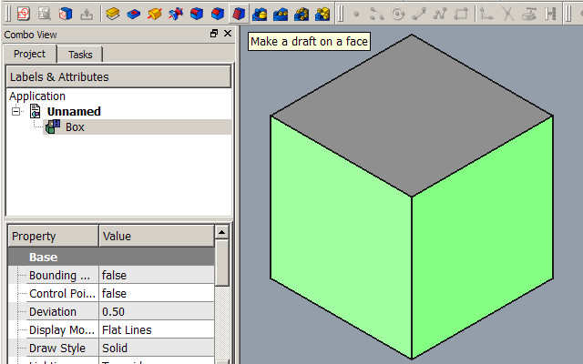
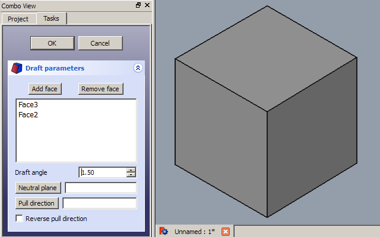
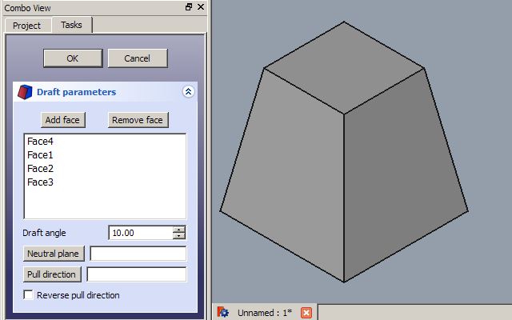
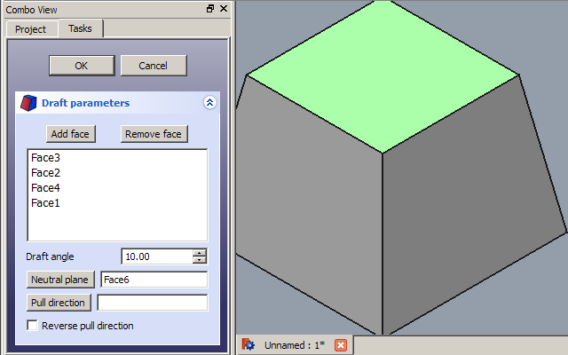
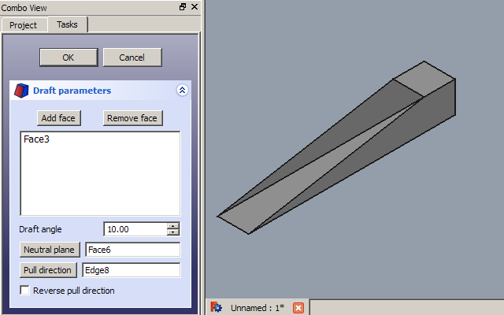
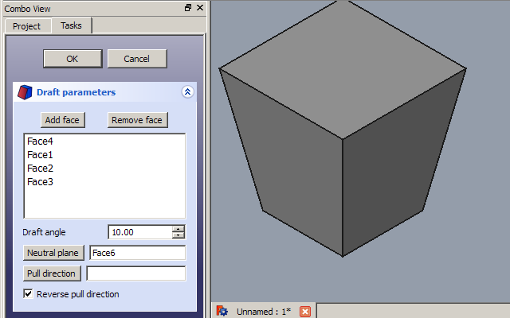

---
- GuiCommand   *
   Name   *PartDesign Draft
   MenuLocation   *Part Design → Apply a dress-up feature → Draft
   Workbenches   *[PartDesign](PartDesign_Workbench.md)
---

# PartDesign Draft

## Description

The [16px\|text-top=Draft\|link=PartDesign\_Draft](Image   *PartDesign_Draft.svg.md) [PartDesign Draft](PartDesign_Draft.md) command creates angular draft on the selected faces of an object. It adds a **Draft** object to the document with its corresponding representation in the [Tree view](Tree_view.md).

   --
          
   --

## Usage

### Add a draft 

1.  Make sure the correct body is active. If required double-click it in the [Tree view](Tree_view.md).
2.  Select one or more face(s) of the active Body.
3.  There are several ways to invoke the Draft command   *
    -   Press the **_[Draft](PartDesign_Draft.md)** button.
    -   Select the **Part Design → Apply a dress-up feature →  Draft** option from the menu.
4.  The **Draft parameters** [task panel](Task_panel.md) opens. See [Options](#Options.md) for more information.
5.  Press the **OK** button to finish the command.

   *   *Remember*   *
    -   Since there must be at least one face for the feature, the last remaining face in the list cannot be removed.

### Edit a draft 

1.  Do one of the following   *
    -   Double-click on the Draft item in the [Tree view](Tree_view.md).
    -   Right-click on the Draft item in the [Tree view](Tree_view.md) and select **Edit Draft** from the context menu.
2.  The **Draft parameters** [task panel](Task_panel.md) opens. See [Options](#Options.md) for more information.
3.  Press the **OK** button to finish the command.

### Options

-    **Draft angle**   * Set the Draft angle either by entering a value or by clicking on the up/down arrows. The applied draft angle is shown in real time.

-    **Add**   * Add faces to the selection by pressing the **Add** button and selecting more faces.

-    **Remove**   * Choose a way to remove faces from the selection   *

    -   Select each face in the list of the dialog and press the **DEL** key or right-click in the list and select **Remove** from the context menu.
    -   Press the **Remove** button. All faces being previously selected are highlighted in purple. Select each face to be removed.

-    **Neutral plane**   * Set the the neutral plane by pressing the **Neutral plane** button and selecting the plane that must not change dimensionally. The change is made in real time.

-    **Pull direction**   * Set the the pull direction by pressing the **Pull direction** button, then select an edge. Pull Direction is only effective if the Neutral Plane has been set. Results can be unpredictable.

-    **Reverse pull direction**   * invert the pull direction by checking the **Reverse pull direction** checkbox. This will toggle the draft between positive and negative angles.

### Special cases 

The Draft tool will only function on faces that are normal to each other. If there are any tangential faces attached to the face you wish to apply draft to, it will fail. A common cause of failure is attempting to apply draft to a face that already has a fillet or chamfer applied to it. In this case, remove the tangential surface, apply the draft as need, then re-apply the fillet or chamfer.

## Properties

See also   * [Property editor](Property_editor.md).

A PartDesign Draft object is derived from a [Part Feature](Part_Feature.md) object and inherits all its properties. It also has the following additional properties   *

### Data

{{Properties_Title|Base}}

-    **Angle|Angle**   * Angle. Default   * {{value|1,50 °}}.

-    **Reversed|Bool**   * Reversed. Default   * `False`.

-    **Base|LinkSub**   * Base. Sub-link to the parent feature\'s list of selected edges and faces.

-    **SupportTransform|Bool**   * Support Transform. \"Include the base additive/subtractive shape when used in pattern features.

   *   If disabled, only the dressed part of the shape is used for patterning. Default   * `False`.

-    **AddSubShape|PartShape|hidden**   * Add Sub Shape.

-    **BaseFeature|Link|hidden**   * Base Feature. Link to the parent feature.

-    **_Body|LinkHidden|hidden**   * \_Body. Hidden link to the parent body.

{{Properties_Title|Draft}}

-    **NeutralPlane|LinkSub**   * Neutral Plane. Sub-link to the parent feature\'s list containing the neutral plane.

-    **PullDirection|LinkSub**   * Pull Direction.

{{Properties_Title|Part Design}}

-    **Refine|Bool**   * \"Refine shape (clean up redundant edges) after adding/subtracting\". Default   * `True`.

 {{PartDesign Tools navi}}

---
 [documentation index](../README.md) > [PartDesign](PartDesign_Workbench.md) > PartDesign Draft
