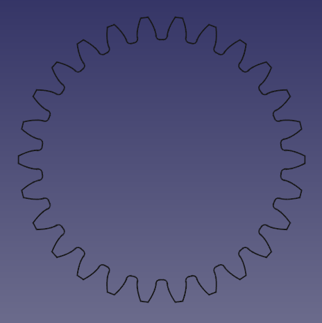

---
- GuiCommand:
   Name:PartDesign InvoluteGear
   MenuLocation:Part Design → Involute gear...
   Workbenches:[PartDesign](PartDesign_Workbench.md)
   SeeAlso:[FCGear Workbench](FCGear_Workbench.md)
---

# PartDesign InvoluteGear

## Description

This tool allows you to create a 2D profile of an involute gear. This 2D profile is fully parametric, and can be padded with the [PartDesign Pad](PartDesign_Pad.md) or [PartDesign AdditiveHelix](PartDesign_AdditiveHelix.md) feature.

For more detailed information see Wikipedia\'s entries for: [Gear](https://en.wikipedia.org/wiki/Gear) and [Involute Gear](https://en.wikipedia.org/wiki/Involute_gear)

  

## Usage

### Create the profile 

1.  Optionally activate the correct body.
2.  Go to the menu **Part Design → [ Involute gear...**.
3.  Set the Involute parameters.
4.  Click **OK**.
5.  If there was no active body: drag and drop the gear into a body for the application of further features like padding.

### Create a spur gear 

1.  Select the gear profile in the tree.
2.  Press the ** '''Pad'''** button.
3.  Set the pad\'s **Length** to the desired face width of the gear.
4.  Click **OK**

### Create a helical gear 

<small>(v0.19)</small> 

1.  Select the gear profile in the tree.
2.  Press the ** [PartDesign AdditiveHelix](PartDesign_AdditiveHelix.md)** button.
3.  Choose as Axis the normal of the gear profile, that is **Normal sketch axis** <small>(v0.20)</small> . (In earlier versions the **Base Z axis** can be used as long as the profile\'s plane has not been altered.)
4.  Choose a **Height-Turns** mode.
5.  Set the **Height** to the desired face width of the gear.
6.  To set the desired helical angle an [Expressions](Expressions.md) for the **Turns** is required.
    1.  Click the blue  icon at the right of the input field.
    2.  Enter the following formula: `Height * tan(25°) / (InvoluteGear.NumberOfTeeth * InvoluteGear.Modules * pi)`, where `25°` is an example for the desired helical angle (aka beta-value) and `InvoluteGear` is the [Name](Object_name.md) of the profile.
    3.  Click **OK** to close the formula editor.
7.  Click **OK** to close the AdditiveHelix\' task panel.

Hint: To make the helical angle an accessible parameter, use a *dynamic property*:

1.  In the profile\'s [property editor](Property_editor.md), activate the **Show all** option in the context menu.
2.  Again in the contest menu, select **Add Property**. Note: this entry is only available when **Show all** is active!
3.  In the \"Add Property\" dialog
    1.  Choose `App::PropertyAngle` as Type.
    2.  Set \"Gear\" as Group.
    3.  Set \"HelicalAngle\" as Name (without space).
    4.  Click **OK**
4.  Now a new property \"Helical Angle\" (space added automatically), with an initial value of `0.0°`, becomes available.
5.  Assign the desired helical angle to the new property.
6.  In the formula of the AdditiveHelix\' **Turns** property, you can now reference `InvoluteGear.HelicalAngle` instead of the hard coded value of e.g. `25°`; again assuming `InvoluteGear` as the [Name](Object_name.md) of the profile.

## Properties

-    **External Gear**: True or false

-    **High Precision**: True or false

-    **Modules**: Pitch diameter divided by the number of teeth.

-    **Number Of Teeth**: Sets the number of teeth.

-    **Pressure Angle**: Acute angle between the line of action and a normal to the line connecting the gear centers. Default is 20 degrees. ([More info](https://en.wikipedia.org/wiki/Involute_gear))

## Tutorials

[How to make gears in FreeCAD](https://www.youtube.com/watch?v=8VNhTrnFMfE)

## Related

-   [FCGear Workbench](FCGear_Workbench.md)

 {{PartDesign Tools navi}}

---
[documentation index](../README.md) > [PartDesign](PartDesign_Workbench.md) > PartDesign InvoluteGear
