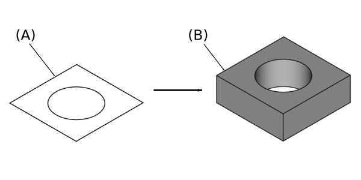

---
- GuiCommand:
   Name:PartDesign Pad
   MenuLocation:Part Design → Create an additive feature → Pad
   Workbenches:[PartDesign](PartDesign_Workbench.md)
   SeeAlso:[PartDesign Pocket](PartDesign_Pocket.md), [Part Extrude](Part_Extrude.md)
---

# PartDesign Pad

## Description

The **Pad** tool extrudes a sketch or a face of a solid along a straight path.

  

*Sketch (A) shown on the left; end result after pad operation (B) on the right.*

## Usage

1.  Select one sketch or face to be padded. <small>(v0.20)</small> : Alternatively you can select several sketches or faces.
2.  Press the ** '''Pad'''** button.
3.  Set the Pad parameters, see the [Options](#Options.md) below.
4.  Click **OK**.

When selecting a single sketch, it can have multiple enclosed profiles inside a larger one, for example a rectangle with two circles inside it. But the profiles may not intersect each other. <small>(v0.20)</small> 

## Options

When creating a pad, the the **Pad parameters** dialog will be shown. It offers the following settings:

### Type

Type offers five different ways of specifying the length to which the pad will be extruded:

#### Dimension

Enter a numeric value for the length of the pad. The default direction for extrusion is away (outside of) the support, but it can be changed by ticking the **Reversed** option. Extrusions occur by default [normal](http://en.wikipedia.org/wiki/Surface_normal) to the defining sketch plane. This can be changed by specifying another **Direction**. With the option **Symmetric to plane** the pad will extend half of the given length to either side of the plane. Negative dimensions are not possible. Use the **Reversed** option instead.

#### To last 

The pad will extrude up to the last face of the support in the extrusion direction. If there is no support, an error message will appear.

#### To first 

The pad will extrude up to the first face of the support in the extrusion direction. If there is no support, an error message will appear.

#### Up to face 

The pad will extrude up to a face in the model that can be chosen by clicking on it.

#### Two dimensions 

This allows to enter a second length in which the pad should extend in the opposite direction (into the support). The directions can be switched by ticking the **Reversed** option.

### Length

Defines the length of the pad. Multiple units can be used independently of the user\'s units preferences (m, cm, mm, nm, ft or \', in or \"). This option is only available when **Type** is either **Dimension** or **Two dimensions**.

### Offset to face 

Offset from face at which the pad will end. This option is only available when **Type** is either **To last**, **To first** or **Up to face**.

### Direction

#### Direction/edge

You can select the direction of the extrusion:

-   **Face/Sketch normal** The sketch or face is extruded along its normal. If you have selected several sketches or faces to be extruded, the normal of the first one will be used. <small>(v0.20)</small> 
-   **Select reference\...** The sketch is extruded along an edge of the 3D model. When this is method selected, you can click on any edge in the 3D model and it becomes the direction vector for the extrusion. <small>(v0.20)</small> 
-   **Custom direction** The sketch is extruded along a direction that can be specified via vector values. <small>(v0.19)</small> 

#### Show direction 

If checked, the pad direction will be shown. In case the pad uses a **Custom direction**, it can be changed. <small>(v0.20)</small> 

#### Length along sketch normal 

If checked, the pad length is measured along the sketch normal, otherwise along the custom direction. <small>(v0.20)</small> 

### Symmetric to plane 

Tick the checkbox to extrude half of the given length to either side of the sketch or plane.

### Reversed

Reverses the direction of the pad.

### Taper angle 

<small>(v0.20)</small> 

Tapers the pad in the extrusion direction by the given angle. A positive angle means the outer pad border gets wider. This option is only available if **Type** is either **Dimension** or **Two dimensions**. Note that inner structures receive the opposite taper angle. This is done to facilitate the design of molds and molded parts.

Limitations:

-   Sketches containing [B-Splines](B-Splines.md) often cannot be properly tapered. This is a limitation of the [OpenCASCADE](OpenCASCADE.md) kernel that FreeCAD uses.
-   For larger angles tapering will fail if the end face of the pad would have fewer edges than the start face/sketch.

### 2nd length 

Defines the length of the pad in the opposite extrusion direction. Multiple units can be used independently of the user\'s units preferences (m, cm, mm, nm, ft or \', in or \"). This option is only available if **Type** is **Two dimensions**.

### 2nd taper angle 

<small>(v0.20)</small> 

Tapers the pad in the opposite extrusion direction by the given angle. A positive angle means the outer pad border gets wider. This option is only available if **Type** is **Two dimensions**. Note that inner structures receive the opposite taper angle. This is done to facilitate the design of molds and molded parts.

## Properties

-    **Type**: Type of ways how the pad will be extruded, see [Options](#Options.md).

-    **Length**: Defines the length of the pad, see [Options](#Options.md).

-    **Length2**: Second pad length in case the **Type** is **TwoLengths**, see [Options](#Options.md).

-    **Use Custom Vector**: <small>(v0.19)</small>  If checked, the pad direction will not be the normal vector of the sketch but the given vector, see [Options](#Options.md).

-    **Direction**: <small>(v0.19)</small>  Vector of the pad direction if **Use Custom Vector** is used.

-    **Along Sketch Normal**: <small>(v0.20)</small>  If *true*, the pad length is measured along the sketch normal. Otherwise and if **Use Custom Vector** is used, it is measured along the custom direction.

-    **Up To Face**: A face the pad will extrude up to, see [Options](#Options.md).

-    **Offset**: Offset from face in which the pad will end. This is only taken into account if the **Type** option **UpToLast**, **UpToFirst** or **UpToFace** is used.

-    **Refine**: True or false. Cleans up residual edges left after the operation. This property is initially set according to the user\'s settings (found in **Preferences → Part design → General → Model settings**). It can be manually changed afterwards. This property will be saved with the FreeCAD document.

## Limitations

-   Like all Part Design features, Pad creates a solid, thus the sketch must include a closed profile or it will fail with a *Failed to validate broken face* error.
-   The algorithm used for **To First** and **To Last** is:
    -   Create a line through the center of gravity of the sketch
    -   Find all faces of the support cut by this line
    -   Choose the face where the intersection point is nearest/furthest from the sketch

:   This means that the face that is found might not always be what you expected. If you run into this problem, use the **Up to face** type instead, and pick the face you want.
:   For the very special case of extrusion to a concave surface, where the sketch is larger than this surface, extrusion will fail. This is a unresolved bug.

 {{PartDesign Tools navi}}

---
 [documentation index](../README.md) > [PartDesign](PartDesign_Workbench.md) > PartDesign Pad
