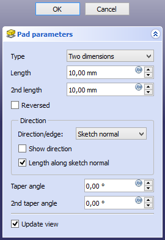

---
 GuiCommand:
   Name: PartDesign Pad
   MenuLocation: Part Design , Create an additive feature , Pad
   Workbenches: PartDesign_Workbench
   SeeAlso: PartDesign_Pocket
---

# PartDesign Pad

## Description

The **Pad** tool extrudes a sketch or a face of a solid along a straight path.

  

*Sketch (A) shown on the left; end result after pad operation (B) on the right.*

## Usage

1.  Select a single sketch or one or more faces from the Body.
2.  Press the ** [Pad](PartDesign_Pad.md)** button.
3.  Set the Pad parameters, see [Options](#Options.md) below.
4.  Press the **OK** button.

## Options

When creating a pad, or after double-clicking an existing pad in the [Tree view](Tree_view.md), the **Pad parameters** task panel is shown. It offers the following settings:

### Type

Type offers five different ways of specifying the length of the pad:

#### Dimension

Enter a numeric value for the **Length** of the pad. With the option **Symmetric to plane** the pad will extend half the given length to either side of the sketch or face.

#### To last 

The pad will extend up to the last face of the support it encounters in its direction. If there is no support, an error message will appear.

#### To first 

The pad will extend up to the first face of the support it encounters in its direction. If there is no support, an error message will appear.

#### Up to face 

The pad will extend up to a face. Press the **Select face** button and select a face or a [datum plane](PartDesign_Plane.md) from the Body.

#### Two dimensions 

This allows to enter a second length in which the pad should extend in the opposite direction. The directions can be switched by checking the **Reversed** option.

#### Up to shape 

<small>(v1.0)</small> 

: The pad will extend up to the selected shape. Optionally press the **Select shape** button and select a shape. Leave the **Select all faces** checkbox enabled or disable it, press the **Select faces** button and select the faces up to which the pad should be created.

### Offset to face 

Offset from face at which the pad will end. This option is only available if **Type** is **To last**, **To first** or **Up to face**.

### Length

Defines the length of the pad. This option is only available if **Type** is **Dimension** or **Two dimensions**. The length is measured along the direction vector, or along the normal of the sketch or face. Negative values are not possible. Use the **Reversed** option instead.

### 2nd length 

Defines the length of the pad in the opposite direction. This option is only available if **Type** is **Two dimensions**.

### Symmetric to plane 

Check this option to extrude half the given length to either side of the sketch or face. This option is only available if **Type** is **Dimension**.

### Reversed

Reverses the direction of the pad.

### Direction

#### Direction/edge

You can select the direction of the extrusion:

-   **Sketch normal** or **Face normal:** The sketch or face is extruded in the direction of its normal. If you have selected several sketches or faces to be extruded, the normal of the first one will be used.
-   **Select reference\...:** The sketch or face is extruded in the direction of a straight edge or a [datum line](PartDesign_Line.md) selected from the Body.
-   **Custom direction:** The sketch or face is extruded in the direction of the specified vector.

#### Show direction 

If checked, the pad direction will be shown. In case the pad uses a **Custom direction**, it can be changed.

#### Length along sketch normal 

If checked, the pad length is measured along the sketch or face normal, otherwise along the custom direction.

### Taper angle 

Tapers the pad in the extrusion direction by the given angle. A positive angle means the outer pad border gets wider. Note that inner structures receive the opposite taper angle. This is done to facilitate the design of molds and molded parts. This option is only available if **Type** is **Dimension** or **Two dimensions**.

### 2nd taper angle 

Tapers the pad in the opposite extrusion direction by the given angle. See **Taper angle**. This option is only available if **Type** is **Two dimensions**.

## Properties

### Data

{{TitleProperty|Pad}}

-    **Type|Enumeration**: Defines how the pad will be extruded, see [Options](#Options.md).

-    **Length|Length**: Defines the length of the pad, see [Options](#Options.md).

-    **Length2|Length**: Second pad length in case the **Type** is **TwoLengths**, see [Options](#Options.md).

-    **Use Custom Vector|Bool**: If checked, the pad direction will not be the normal vector of the sketch but the given vector, see [Options](#Options.md).

-    **Direction|Vector**: Vector of the pad direction if **Use Custom Vector** is used.

-    **Reference Axis|LinkSub**
    

-    **Along Sketch Normal|Bool**: If *true*, the pad length is measured along the sketch normal. Otherwise and if **Use Custom Vector** is used, it is measured along the custom direction.

-    **Up To Face|LinkSub**: A face the pad will extrude up to, see [Options](#Options.md).

-    **Offset|Length**: Offset from face in which the pad will end. This is only taken into account if the **Type** option **UpToLast**, **UpToFirst** or **UpToFace** is used.

-    **Taper Angle|Angle**
    

-    **Taper Angle2|Angle**
    

{{TitleProperty|Part Design}}

-    **Refine|Bool**: True or false. Cleans up residual edges left after the operation. This property is initially set according to the user\'s settings (found in **Preferences → Part Design → General → Model settings**).

{{TitleProperty|Sketch Based}}

-    **Profile|LinkSub**
    

-    **Midplane|Bool**
    

-    **Reversed|Bool**
    

-    **Allow Multi Face|Bool**
    

## Limitations

-   Like all Part Design features, Pad creates a solid, thus the sketch must include a closed profile or it will fail with a *Failed to validate broken face* error.
-   Sketches containing [B-Splines](B-Splines.md) often cannot be tapered properly. This is a limitation of the [OpenCASCADE](OpenCASCADE.md) kernel that FreeCAD uses.
-   For larger angles tapering will fail if the end face would have fewer edges than the start face/sketch.
-   The algorithm used for **To First** and **To Last** is:
    -   Create a line through the center of gravity of the sketch
    -   Find all faces of the support cut by this line
    -   Choose the face where the intersection point is nearest/furthest from the sketch

:   This means that the face that is found might not always be what you expected. If you run into this problem, use the **Up to face** type instead, and pick the face you want.
:   For the very special case of extrusion to a concave surface, where the sketch is larger than this surface, extrusion will fail. This is an unresolved bug.

 {{PartDesign Tools navi}}

---
⏵ [documentation index](../README.md) > [PartDesign](PartDesign_Workbench.md) > PartDesign Pad
