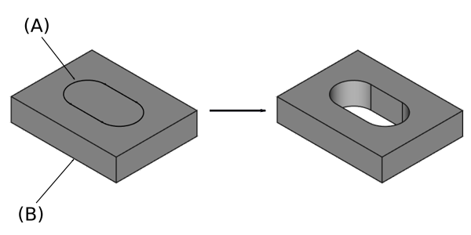

---
 GuiCommand:
   Name: PartDesign Pocket
   MenuLocation: Part Design , Create a substractive feature , Pocket
   Workbenches: PartDesign_Workbench
   SeeAlso: PartDesign_Pad
---

# PartDesign Pocket

## Description

The **Pocket** tool cuts solids by extruding a sketch or a face of a solid along a straight path.

   *Sketch profile (A) was mapped to the top face of base solid (B); result after pocketing through on the right.*

## Usage

1.  Select a single sketch or one or more faces from the Body.
2.  Press the ** [Pocket](PartDesign_Pocket.md)** button.
3.  Set the Pocket parameters, see [Options](#Options.md) below.
4.  Press the **OK** button.

## Options

When creating a pocket, or after double-clicking an existing pocket in the [Tree view](Tree_view.md), the **Pocket parameters** task panel is shown. It offers the following settings:

### Type

Type offers five different ways of specifying the length of the pocket:

#### Dimension

Enter a numeric value for the **Length** of the pocket. With the option **Symmetric to plane** the pocket will extend half the given length to either side of the sketch or face.

#### Through all 

The pocket will extend up to the last face of the support it encounters in its direction. With the option **Symmetric to plane** the pocket will cut through all material in both directions. Note that for technical reasons, *Through All* is actually a 10 meter deep pocket. If you need deeper pockets, use the type **Dimension**.

#### To first 

The pocket will extend up to the first face of the support it encounters in its direction.

#### Up to face 

The pocket will extend up to a face. Press the **Select face** button and select a face or a [datum plane](PartDesign_Plane.md) from the Body.

#### Two dimensions 

This allows to enter a second length in which the pocket should extend in the opposite direction. The directions can be switched by checking the **Reversed** option.

#### Up to shape 

<small>(v1.0)</small> 

: The pocket will extend up to the selected shape. Optionally press the **Select shape** button and select a shape. Leave the **Select all faces** checkbox enabled or disable it, press the **Select** button and select the faces up to which the pocket should be created.

### Offset to face 

Offset from face at which the pocket will end. This option is only available if **Type** is **Through all**, **To first** or **Up to face**.

### Length

Defines the length of the pocket. This option is only available if **Type** is **Dimension** or **Two dimensions**. The length is measured along the direction vector, or along the normal of the sketch or face. Negative values are not possible. Use the **Reversed** option instead.

### 2nd length 

Defines the length of the pocket in the opposite direction. This option is only available if **Type** is **Two dimensions**.

### Symmetric to plane 

Check this option to extrude half the given length to either side of the sketch or face, if **Type** is **Dimension**, or **Through all** if that is the **Type**.

### Reversed

Reverses the direction of the pocket.

### Direction

#### Direction/edge

You can select the direction of the extrusion:

-   **Sketch normal** or **Face normal:** The sketch or face is extruded in the opposite direction of its normal. If you have selected several sketches or faces to be extruded, the normal of the first one will be used.
-   **Select reference\...:** The sketch or face is extruded in the opposite direction of a straight edge or a [datum line](PartDesign_Line.md) selected from the Body.
-   **Custom direction:** The sketch or face is extruded in the direction of the specified vector.

#### Show direction 

If checked, the pocket direction will be shown. In case the pocket uses a **Custom direction**, it can be changed.

#### Length along sketch normal 

If checked, the pocket length is measured along the sketch or face normal, otherwise along the custom direction.

### Taper angle 

Tapers the pocket in the extrusion direction by the given angle. A positive angle means the outer pocket border gets wider. Note that inner structures receive the opposite taper angle. This is done to facilitate the design of molds and molded parts. This option is only available if **Type** is **Dimension** or **Two dimensions**.

### 2nd taper angle 

Tapers the pocket in the opposite extrusion direction by the given angle. See **Taper angle**. This option is only available if **Type** is **Two dimensions**.

## Properties

### Data

{{TitleProperty|Part Design}}

-    **Refine|Bool**: True or false. Cleans up residual edges left after the operation. This property is initially set according to the user\'s settings (found in **Preferences → Part Design → General → Model settings**).

{{TitleProperty|Pocket}}

-    **Type|Enumeration**: Defines how the pocket will be extruded, see [Options](#Options.md).

-    **Length|Length**: Defines the length of the pocket, see [Options](#Options.md).

-    **Length2|Length**: Second pocket length in case the **Type** is **TwoLengths**, see [Options](#Options.md).

-    **Use Custom Vector|Bool**: If checked, the pocket direction will not be the normal vector of the sketch but the given vector, see [Options](#Options.md).

-    **Direction|Vector**: Vector of the pocket direction if **Use Custom Vector** is used.

-    **Reference Axis|LinkSub**
    

-    **Along Sketch Normal|Bool**: If *true*, the pocket length is measured along the sketch normal. Otherwise and if **Use Custom Vector** is used, it is measured along the custom direction.

-    **Up To Face|LinkSub**: A face the pocket will extrude up to, see [Options](#Options.md).

-    **Offset|Length**
    

-    **Taper Angle|Angle**
    

-    **Taper Angle2|Angle**
    

{{TitleProperty|Sketch Based}}

-    **Profile|LinkSub**
    

-    **Midplane|Bool**
    

-    **Reversed|Bool**
    

-    **Allow Multi Face|Bool**
    

## Limitations

-   Use the type **Dimension** or **Through All** wherever possible because the other types sometimes give trouble when they are being patterned
-   Otherwise, the pocket feature has the same [limitations](PartDesign_Pad#Limitations.md) as the Pad feature.

 {{PartDesign Tools navi}}

---
⏵ [documentation index](../README.md) > [PartDesign](PartDesign_Workbench.md) > PartDesign Pocket
