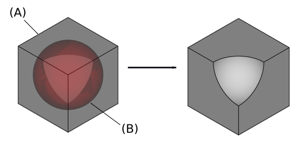

---
- GuiCommand:
   Name:PartDesign SubtractiveSphere
   MenuLocation:Part Design → Create a subtractive primitive → Subtractive Sphere
   Workbenches:[PartDesign](PartDesign_Workbench.md)
   Version:0.17
   SeeAlso:[PartDesign CompPrimitiveSubtractive](PartDesign_CompPrimitiveSubtractive.md), [PartDesign AdditiveSphere](PartDesign_AdditiveSphere.md)
---

# PartDesign SubtractiveSphere

## Description

Inserts a subtractive sphere in the active Body. Its shape is subtracted from the existing solid.

   *On the left: active body (A) shown in grey and subtractive sphere (B) shown in transparent red; result on the right.*

## Usage

1.  Press the ** '''Subtractive Sphere'''** button. **Note**: the Subtractive Sphere is part of an icon menu labelled *Create an additive primitive*. After launching FreeCAD, the Subtractive Box is the one displayed in the toolbar. To get the Sphere, click on the down arrow besides the visible icon and select Subtractive Sphere in the menu.
2.  Set the Primitive parameters and [Attachment](Part_EditAttachment.md).
3.  Click **OK**.
4.  A Sphere feature appears under the active Body.

## Options

The Sphere can be edited after its creation in two ways:

-   Double-clicking it in the Model tree, or by right-clicking and selecting **Edit primitive** in the contextual menu; this brings up the Primitive parameters.
-   Via the [Property editor](Property_editor.md).

## Properties

-    **Attachment**: defines the attachment mode as well as the Attachment Offset. See [Part EditAttachment](Part_EditAttachment.md).

-    **Label**: Label given to the Sphere object. Change to suit your needs.

-    **Radius**: Radius of the sphere.

-    **Angle1**: (labelled *V parameter* in the Primitive parameters) lower truncation of the sphere, parallel to the circular cross section (-90 degrees in a full sphere)

-    **Angle2**: (unlabelled in the Primitive parameters) upper truncation of the ellipsoid, parallel to the circular cross section (90 degrees in a full sphere).

-    **Angle3**: (labelled *U parameter* in the Primitive parameters) angle of rotation of the cross section (360 degrees in a full sphere).

 {{PartDesign_Tools_navi}}

---
 [documentation index](../README.md) > [PartDesign](PartDesign_Workbench.md) > PartDesign SubtractiveSphere
