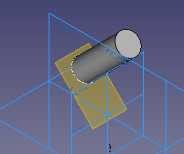
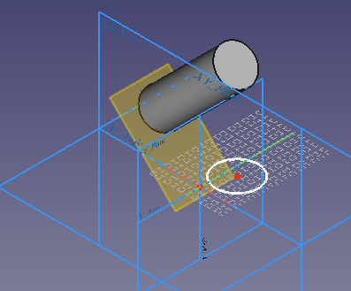
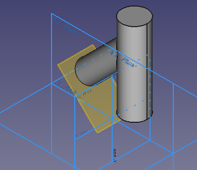
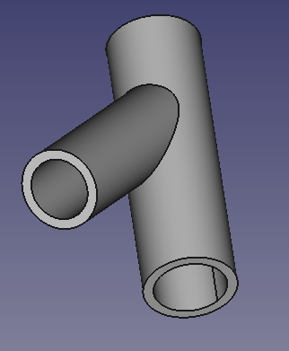

---
- GuiCommand   *
   Name   *PartDesign Thickness
   MenuLocation   *Part Design → Apply a dress-up feature → Thickness
   Workbenches   *[PartDesign](PartDesign_Workbench.md)
   Version   *0.17
   SeeAlso   *[Part Thickness](Part_Thickness.md)
---

# PartDesign Thickness

## Description

The [16px\|text-top=Thickness\|link=PartDesign\_Thickness](Image   *PartDesign_Thickness.svg.md) [PartDesign Thickness](PartDesign_Thickness.md) command works on a solid body and transforms it into a hollow object with at least one open face, giving to each of its remaining faces a uniform thickness. It adds a **Thickness** object to the document with its corresponding representation in the [Tree view](Tree_view.md).

   
*Base solid (A) →  Solid with selected face to be opened (B) →  Resulting hollow object (C)*

## Usage

### Add a thickness 

1.  Make sure the correct body is active. If required double-click it in the [Tree view](Tree_view.md).
2.  Select one or more face(s) of the active Body.
3.  There are several ways to invoke the Thickness tool   *
    -   Press the **_[Thickness](PartDesign_Thickness.md)** button.
    -   Select the **Part Design → Apply a dress-up feature →  Thickness** option from the menu.
4.  The **Thickness parameters** [task panel](Task_panel.md) opens. See [Options](#Options.md) for more information.
5.  Press the **OK** button to finish the command.

   *   *Remember*   *
    -   Since there must be at least one face for the feature, the last remaining face in the list cannot be removed.

### Edit a thickness 

1.  Do one of the following   *
    -   Double-click on the Thickness item in the [Tree view](Tree_view.md)
    -   Right-click on the Thickness item in the [Tree view](Tree_view.md) and select **Edit Thickness** from the context menu.
2.  The **Thickness parameters** [task panel](Task_panel.md) opens. See [Options](#Options.md) for more information.
3.  Press the **OK** button to finish the command.

## Options

-    **Thickness**   * Set the desired wall thickness of the resulting object either by editing the value or by clicking on the up/down arrows.

-    **Mode**   *

    -   
        **Skin**
        
           * Select this option if you want to get an item like a vase, headless but with the bottom

    -   
        **Pipe**
        
           * Select this option if you want to get an object like a pipe, headless and bottomless.

    -   
        **Recto Verso**
        
           *

   *   (In case you wonder   * **Pipe** and **Recto Verso** functionality hasn\'t been implemented since version 0.13, see [2013 topic](https   *//forum.freecadweb.org/viewtopic.php?p=35987#p35987) and [2021 follow-up](https   *//forum.freecadweb.org/viewtopic.php?p=484495#p484495))

-    **Join Type**   *

    -   
        **Arc**
        
           * Removes the outer edges and creates a fillet with a radius equal to the defined thickness.

    -   
        **Intersection**
        
           * When faces are offset outward, sharp edges are kept between faces.

-    **Make thickness inwards**   * When checked, faces are offset inward.

## Properties

See also   * [Property editor](Property_editor.md).

A PartDesign Thickness object is derived from a [Part Feature](Part_Feature.md) object and inherits all its properties. It also has the following additional properties   *

### Data

{{Properties_Title|Base}}

-    **Base|LinkSub**   * Base. Sub-link to the parent feature\'s list of selected edges and faces.

-    **SupportTransform|Bool**   * Support Transform. \"Include the base additive/subtractive shape when used in pattern features.

   *   If disabled, only the dressed part of the shape is used for patterning. Default   * `False`.

-    **AddSubShape|PartShape|hidden**   * Add Sub Shape.

-    **BaseFeature|Link|hidden**   * Base Feature. Link to the parent feature.

-    **_Body|LinkHidden|hidden**   * \_Body. Hidden link to the parent body.

{{Properties_Title|Part Design}}

-    **Refine|Bool**   * \"Refine shape (clean up redundant edges) after adding/subtracting\". Default   * `True`.

{{Properties_Title|Thickness}}

-    **Value|Length**   * Value. \"Thickness value\". Default   * {{value|1,00 mm}}.

-    **Mode|Enumeration**   * Mode. {{value|Skin}} (default), {{value|Pipe}} (seems to be useless).

   *   (\"Recto verso\" isn\'t even listed here\...)

-    **Join|Enumeration**   * Join. \"Join type\".{{value|Arc}} (default).

-    **Reversed|Bool**   * Reversed. \"Apply the thickness towards the solids interior\". Default   * `False`.

-    **Intersection|Bool**   * Intersection. \"Enable intersection-handling\". Default   * `False`.

## Limitations

-   At least one face to be opened must be selected.
-   If thickness goes inwards, the value must be smaller than the smallest height of the Body.
-   The command may fail with complex shapes. In this context the surface of e.g. a cone has already to be regarded as complex.
    -   [Additive Pipe](PartDesign_AdditivePipe.md) or [Additive Loft](PartDesign_AdditiveLoft.md) may work better to create complex shapes

## Example

1.  Create a Pad from the sketch
2.  Create a second sketch on the XY plane
3.  Create a second Pad from the second sketch

As in the following pictures   *

 

 

Then

1.  Select a circular face
2.  Select ** Thickness
**
3.  Add the other circular faces to the selection

Result   *   

## Known Errors 

-   BRep\_API   * command not done
-   BRep\_Tool   * no parameter on edge
-   Silently Fails

 {{PartDesign Tools navi}}

---
 [documentation index](../README.md) > [PartDesign](PartDesign_Workbench.md) > PartDesign Thickness
