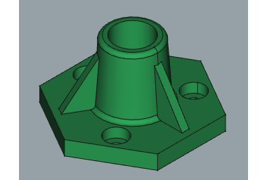

# PartDesign Workbench sandbox
## Introduction

The  [PartDesign Workbench](PartDesign_Workbench.md) provides tools for modeling solid components. It is mostly focused on creating mechanical components that can be manufactured and assembled into a finished product. Nevertheless, the created solids can be used for any other purpose such as [BIM modeling](BIM_Workbench.md), [finite element analysis](FEM_Workbench.md), or [machining and 3D printing](CAM_Workbench.md).

The PartDesign Workbench uses a feature based methodology. A component is represented by the Body object container. The Body defines a local coordinate system and contains the cumulative features that define the component. Most features are based on parametric sketches and are either additive or subtractive. For example, the Pad tool adds the extruded sketch to the developing solid, the Pocket tool subtracts the extruded sketch. Each feature is cumulative and builds on the result of preceding features. It is also possible to use primitives ([Cylinder](PartDesign_AdditiveCylinder.md), [Sphere](PartDesign_AdditiveSphere.md), etc.) as well as solids created outside the Body as features.

See the [feature editing](feature_editing.md) page for a more complete explanation of this process, and then see [Creating a simple component with PartDesign](Creating_a_simple_part_with_PartDesign.md) to get started with creating solids.

The  [Part Workbench](Part_Workbench.md) provides an alternative [constructive solid geometry](constructive_solid_geometry.md) (CSG) methodology for building shapes

A more detailed discussion of Part workbench versus Part Design workbench can be found here: [Part and Part Design](Part_and_PartDesign.md).

---
⏵ [documentation index](../README.md) > PartDesign Workbench sandbox
