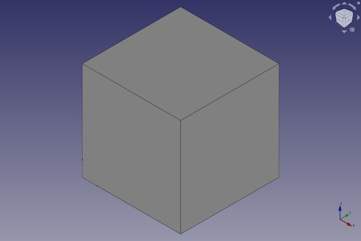
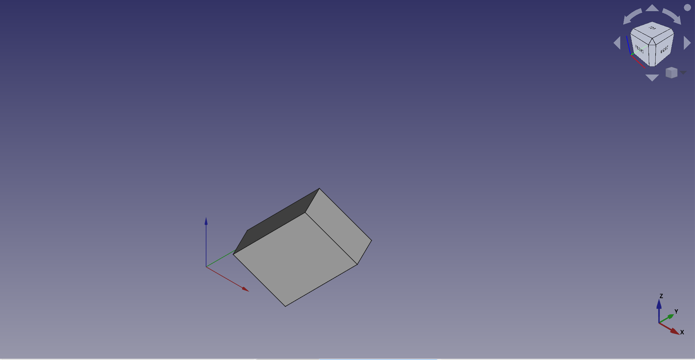

---
- GuiCommand:
   Name:Part Box
   MenuLocation:Part → Primitives → Cube
   Workbenches:[Part](Part_Workbench.md)
   SeeAlso:[Part Primitives](Part_Primitives.md)
---

# Part Box

## Description

The  [Part Box](Part_Box.md) command creates a parametric box solid.

FreeCAD creates a cube, each side with an equal length of 10 millimetre.

By default, the box is positioned with the lower left corner at the origin (0,0,0). The bottom of the cube is on the xy-plane. Its extension in x, y and z direction follows the positive axis values.

  

## Usage

1.  There are several ways to invoke the command:
    -   Press the ** [Cube](Part_Cube.md)** button.
    -   Select the **Part → Primitives →  Cube** option from the menu.

## Example



A Part Box object with the values of the bottom scripting example are shown here.

## Properties

See also: [Property editor](Property_editor.md).

A Part Box object is derived from a [Part Feature](Part_Feature.md) object and inherits all its properties. It also has the following additional properties:

### Data


{{TitleProperty|Box}}

-    **Length|Length**: The length of the box. This is the dimension in the x-direction.

-    **Width|Length**: The width of the box. This is the dimension in the y-direction.

-    **Height|Length**: The height of the box. This is the dimension in the z-direction.

## Scripting

A Part Box is created with the {{Incode|addObject()}} method of the document.

 
```python
box = FreeCAD.ActiveDocument.addObject("Part::Box", "myBox")
```

-   Where {{Incode|myBox}} is the name for the object. The name must be unique for the entire document.
-   The function returns the newly created object.

The {{Incode|Label}} is the user editable name for the object. It can be easily changed by

 
```python 
box.Label = "new myBoxName"
```

You can access and modify attributes of the {{Incode|box}} object. For example, you may wish to modify the length, width and height parameters.

 
```python
box.Length = 4
box.Width = 8
box.Height = 12
```

You can change its placement and orientation with:

 
```python
box.Placement = FreeCAD.Placement(FreeCAD.Vector(1, 2, 3), FreeCAD.Rotation(75, 60, 30))
```


---
 [documentation index](../README.md) > [Part](Part_Workbench.md) > Part Box
