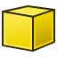
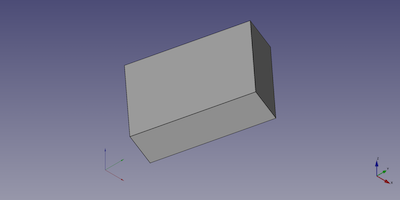

---
- GuiCommand:
   Name:Part Box
   MenuLocation:Part → Primitives → Cube
   Workbenches:[Part](Part_Workbench.md)
   SeeAlso:[Part Primitives](Part_Primitives.md)
---

# Part Box

## Description

The Box command from the [Part Workbench](Part_Workbench.md) inserts a parametric, [rectangular cuboid](http://en.wikipedia.org/wiki/Cuboid#Rectangular_cuboid), geometric primitive into the active document. By default, the Box command will insert a 10x10x10 mm cube, positioned at the origin, with the label \"cube\". These parameters may be modified after the object has been added.

  

## Usage

1.  Switch to the  [Part Workbench](Part_Workbench.md)
2.  There are several ways to invoke the command:
    -   Press the ** Cube** button in the toolbar.
    -   Select the **Part → Primitives →  Cube** from the menu bar.

**Result:** The default result is a box with an equal length, width and height of 10 mm. It is attached to the global xy-plane and one edge is coincident with the global z-axis.

The box properties can later be edited, either in the property editor or by double-clicking on the box in the model tree.

## Properties

See also: [Property editor](Property_editor.md).

A Part Box object is derived from a [Part Feature](Part_Feature.md) object and inherits all its properties. It also has the following additional properties:

### Data


{{TitleProperty|Box}}

-    **Length|Length**: The length of the box. This is the dimension in the X direction.

-    **Width|Length**: The width of the box. This is the dimension in the Y direction.

-    **Height|Length**: The height of the box. This is the dimension in the Z direction.

## Notes

By default, a box is created with three sides of equal length (cubes) of 10 mm each.

This can be easily recognized by the additional tick at the icon in the tree view.

## Limitations

## Scripting

A Part Box can be created using the following function:

 
```python
box = FreeCAD.ActiveDocument.addObject("Part::Box", "myBox")
```

-   Where {{Incode|"myBox"}} is the name for the object.
-   The function returns the newly created object.

The name of the object can be easily changed by

 
```python
box.Label = "new boxName"
```

You can access and modify attributes of the {{Incode|box}} object. For example, you may wish to modify the length, width and height parameters.

 
```python
box.Length = 20
box.Width = 10
box.Height = 30
```

You can change its placement with:

 
```python
box.Placement = FreeCAD.Placement(FreeCAD.Vector(4, 6, 3), FreeCAD.Rotation(30, 45, 10))
```

The Part Box with the values of the scripting example looks like:




---
 [documentation index](../README.md) > [Part](Part_Workbench.md) > Part Box
