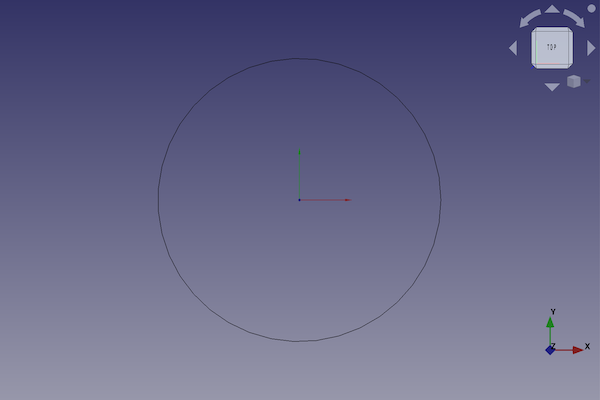
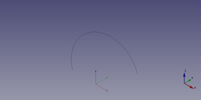

---
- GuiCommand:
   Name:Part Circle
   MenuLocation:Part → [Create primitives](Part_Primitives.md) → Circle
   Workbenches:[Part](Part_Workbench.md)
   SeeAlso:
---

# Part Circle

## Description

The  [Part Circle](Part_Circle.md) command creates a parametric circle shape.

FreeCAD creates a circle, with default values for the radius and two angles.

By default, the circle is positioned with its center at the origin (0,0,0). It lays on the xy-plane.



## Usage

1.  There are several ways to invoke the command:
    -   Press the ** [Create Primitives...](Part_Primitives.md)** button.
    -   Select the **Part → Create Primitives →  Create Primitives...** option from the menu.
    -   Select the ** Circle** option from the menu.
2.  Set options and press **Create**.
3.  To close the dialog press **Close**.

## Example



A Part Circle object with the values of the bottom scripting example are shown here.

## Notes

This command will create a circular curved edge. With the default values, the circular curved edge will be closed and therefore will be a circle. If the properties Angle 0 or Angle 1 are changed from their default values (0 and 360) the edge will be an open curve, an arc.

Alternatively a Part Circle can be initially defined from three points. Once created the circle will only contain the standard Part Circle properties and will no longer contain a reference to the creation points.

## Properties

See also: [Property editor](Property_editor.md).

A Part Circle object is derived from a [Part Feature](Part_Feature.md) object and inherits all its properties. It also has the following additional properties:

### Data


{{TitleProperty|Base}}

-    **Radius|Length**: The radius of the curved edge (arc or circle)

-    **Angle 0|Angle**}: Start of the curved edge, (degrees counter-clockwise), the default value is 0°

-    **Angle 1|Angle**}: End of the curved edge, (degrees counter-clockwise), the default value is 360°

## Scripting

A Part Circle is created with the {{Incode|addObject()}} method of the document.

 
```python
circle = FreeCAD.ActiveDocument.addObject("Part::Circle", "myCircle")
```

-   Where {{Incode|myCircle}} is the name for the object. The name must be unique for the entire document.
-   The function returns the newly created object.

The {{Incode|Label}} is the user editable name for the object. It can be easily changed by

 
```python
circle.Label = "new myCircleName"
```

You can access and modify attributes of the {{Incode|circle}} object. For example, you may wish to modify the radius or the two angle parameters.

 
```python
circle.Radius = 10
circle.Angle1 = 45
circle.Angle2 = 225
```

The result will be a 45 degree rotated semicircle with a radius of 10.

You can change its placement and orientation with:

 
```python
circle.Placement = FreeCAD.Placement(FreeCAD.Vector(1, 2, 3), FreeCAD.Rotation(30, 45, 10))
```


---
 [documentation index](../README.md) > [Part](Part_Workbench.md) > Part Circle
