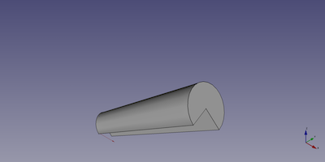

---
- GuiCommand:
   Name:Part Cone
   MenuLocation:Part → Primitives → Cone
   Workbenches:[Part](Part_Workbench.md)
   SeeAlso:[Part Primitives](Part_Primitives.md)
---

# Part Cone

## Description

The  [Part Cone](Part_Cone.md) command creates a parametric cone solid.

FreeCAD creates a cone, each side with a radius of 2 millimetre a height of 10 millimetre.

By default, the cone is positioned with the center of the bottom face at the origin (0,0,0). The bottom of the cone is on the xy-plane. Its extension in z-direction follows the positive axis value.

  

## Usage

1.  There are several ways to invoke the command:
    -   Press the ** [Cone](Part_Cone.md)** button.
    -   Select the **Part → Primitives →  Cone** option from the menu.

## Example



A Part Cone object with the values of the bottom scripting example are shown here.

## Properties

See also: [Property editor](Property_editor.md).

A Part Torus object is derived from a [Part Feature](Part_Feature.md) object and inherits all its properties. It also has the following additional properties:

### Data


{{TitleProperty|Cone}}

-    **Radius1|Length**: Radius of the arc or circle defining the lower face

-    **Radius2|Length**: Radius of the arc or circle defining the upper face

-    **Height|Length**: Height of the Part Cone

-    **Angle|Angle**: Number of degrees of the arc or circles defining the upper and lower faces of the truncated cone. The default 360° angle creates circular faces, a lower value will create a portion of a cone as defined by upper and lower faces each with edges defined by an arc of the number of degrees and two radii.

## Scripting

A Part Cone can be created using the following function:

 
```python
cone = FreeCAD.ActiveDocument.addObject("Part::Cone", "myCone")
```

-   Where {{Incode|myCone}} is the user editable name for the object.
-   The function returns the newly created object.

The label text of the object can be easily changed by

 

You can access and modify attributes of the {{Incode|cone}} object. For example, you may wish to modify the lower or upper radius, the height or the angle parameters.

 
```python
cone.Radius1 = 5
cone.Radius2 = 10
cone.Height = 50
cone.Angle = 270
```

The result will be a 270° portion of a full cone.

You can change its placement and orientation with:

 
```python
cone.Placement = FreeCAD.Placement(FreeCAD.Vector(1, 2, 3), FreeCAD.Rotation(30, 60, 15))
```


---
 [documentation index](../README.md) > [Part](Part_Workbench.md) > Part Cone
