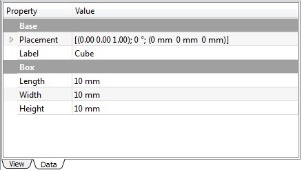

---
- GuiCommand:
   Name:Part Box
   MenuLocation:Part → Primitives → Cube
   Workbenches:[Part](Part_Workbench.md)
   SeeAlso:[Part Primitives](Part_Primitives.md)
---

## Description

The Box command from the [Part Workbench](Part_Workbench.md) inserts a parametric, [rectangular cuboid](http://en.wikipedia.org/wiki/Cuboid#Rectangular_cuboid), geometric primitive into the active document. By default, the Box command will insert a 10x10x10 mm cube, positioned at the origin, with the label \"cube\". These parameters may be modified after the object has been added.


## Usage

1.  Switch to the  [Part Workbench](Part_Workbench.md)
2.  There are several ways to invoke the command:
    -   Press the ** Cube** button in the toolbar.
    -   Select the {{MenuCommand|Part → Primitives →  Cube}} from the menu bar.

**Result:** The default result is a box with an equal length, width and height of 10 mm. It is attached to the global xy-plane and one edge is coincident with the global z-axis.

The box properties can later be edited, either in the property editor or by double-clicking on the box in the model tree.

## Properties


{{Properties_Title|Base}}

-    **Placement**: Specifies the orientation and position of the Box in the 3D space. See [Placement](Placement.md). The reference point is the left front lower corner of the box.

-    **Label**: Label given to the Box object. Change to suit your needs.


{{Properties_Title|Box}}

-    **Length**: The length parameter is the Box\'s dimension in the x-direction.

-    **Width**: The width parameter is the Box\'s dimension in the y-direction.

-    **Height**: The height parameter is the Box\'s dimension in the z-direction.



## Scripting

The Box command can by used in [macros](Macros.md) and from the python console using the following function:  
```python
FreeCAD.ActiveDocument.addObject("Part::Box", "myBox")
```

-   Where \"myBox\" is the label for the Box object.
-   Returns newly created object of type Box.

You can access and modify attributes of the Box object. For example, you may wish to modify the length, width and height parameters.  
```python
FreeCAD.ActiveDocument.myBox.Length = 25
FreeCAD.ActiveDocument.myBox.Width = 15
FreeCAD.ActiveDocument.myBox.Height = 30
```

You can change its placement with:  
```python
FreeCAD.ActiveDocument.myBox.Placement = FreeCAD.Placement(FreeCAD.Vector(4, 6, 3), FreeCAD.Rotation(30, 45, 10))
```


  
