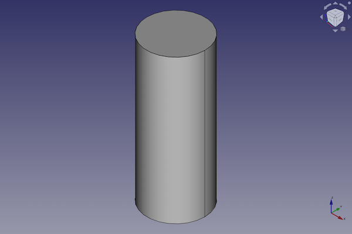
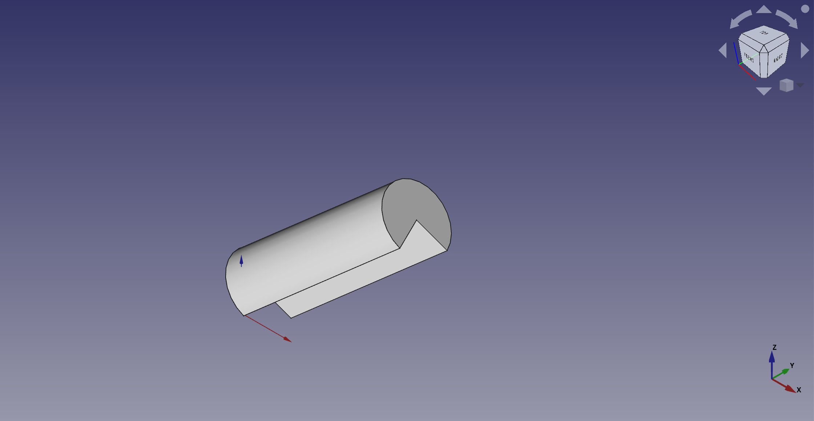

---
- GuiCommand:
   Name:Part Cylinder
   MenuLocation:Part → Primitives → Cylinder
   Workbenches:[Part](Part_Workbench.md)
   SeeAlso:[Part Primitives](Part_Primitives.md)
---

# Part Cylinder

## Description

The  [Part Cylinder](Part_Cylinder.md) command creates a parametric cylinder solid.

FreeCAD creates a cylinder, with a radius of 2 millimetres and a height of 10 millimetre.

By default, the cylinder is positioned with the center of the bottom circle at the origin (0,0,0). The bottom of the cylinder is on the xy-plane. Its extension in z-direction follows the positive axis value.

  

## Usage

1.  There are several ways to invoke the command:
    -   Press the ** [Cylinder](Part_Cylinder.md)** button.
    -   Select the **Part → Primitives →  Cylinder** option from the menu.

## Example



A Part Cylinder object with the values of the bottom scripting example are shown here.

The described placement and orientation changes are not shown because of simplicity for the given example.

## Properties

See also: [Property editor](Property_editor.md).

A Part Cylinder object is derived from a [Part Feature](Part_Feature.md) object and inherits all its properties. It also has the following additional properties:

### Data


{{TitleProperty|Cylinder}}

-    **Radius|Radius**: The radius of the cylinder. This defines a plane in the XY area.

-    **Height|Height**: The height of the cylinder. This is the dimension in the Z direction.

-    **Angle|Angle**: The rotation angle of the cylinder. The rotation angle permits the creation of a portion of cylinder (it is set to 360° by default).


{{TitleProperty|Prism}}

-    **First Angle|Angle**: Angle in first direction. This is the rotation around the Y axis. <small>(v0.20)</small> 

-    **Second Angle|Angle**: Angle in second direction. This is the rotation around the X axis.<small>(v0.20)</small> 

## Scripting

A Part Cylinder can be created using the following function:

 
```python
cylinder = FreeCAD.ActiveDocument.addObject("Part::Cylinder", "myCylinder")
```

-   Where {{Incode|myCylinder}} is the user editable name for the object.
-   The function returns the newly created object.

The label text of the object can be easily changed by

 
```python
cylinder.Label = "new myCylinderName"
```

For example, you may wish to modify the width, length or of the start and finish vertex.

 
```python
cylinder.Radius = 10
cylinder.Height = 25
cylinder.Angle = 270
cylinder.FirstAngle = 30
cylinder.SecondAngle = 45
```

The result is a three-quarter cylinder.

You can change its placement and orientation with:

 
```python
cylinder.Placement = FreeCAD.Placement(FreeCAD.Vector(1, 2, 3), FreeCAD.Rotation(75, 60, 30))
```


---
 [documentation index](../README.md) > [Part](Part_Workbench.md) > Part Cylinder
