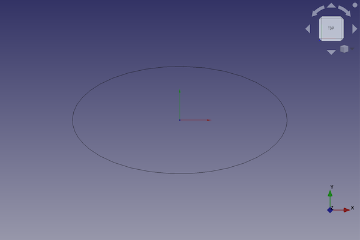

---
- GuiCommand:
   Name:Part Ellipse
   MenuLocation:Part → [Create primitives](Part_Primitives.md) → Ellipse
   Workbenches:[Part](Part_Workbench.md), [OpenSCAD](OpenSCAD_Workbench.md)
   SeeAlso:[Part Primitives](Part_Primitives.md)
---

# Part Ellipse

## Description

The  [Part Ellipse](Part_Ellipse.md) command creates a parametric ellipse shape.

FreeCAD creates an ellipse, with default values for major and minor radius and the angles for the start and end point of the curve.

By default, the ellipse is positioned with its center point at the origin (0,0,0). Its major radius goes to the x-direction. The minor radius goes to the y-direction. The shape lays on the xy-area.



## Usage

1.  There are several ways to invoke the command:
    -   Press the ** [Create Primitives...](Part_Primitives.md)** button.
    -   Select the **Part → Create Primitives →  Create Primitives...** option from the menu.
    -   Select the ** Ellipse** option from the menu.
2.  Set options and press **Create**.
3.  To close the dialog press **Close**.

## Example


A Part Ellipse object with the values of the bottom scripting example are shown here.

## Properties

See also: [Property editor](Property_editor.md).

A Part Ellipse object is derived from a [Part Feature](Part_Feature.md) object and inherits all its properties. It also has the following additional properties:

### Data


{{TitleProperty|Base}}

-    **MajorRadius|Length**: The major radius of the ellipse. This is the dimension in the x-direction.

-    **MinorRadius|Length**: The minor radius of the ellipse. This is the dimension in the y-direction.

-    **Angle1|Angle**: The first angle of the ellipse. This is the angle for the start point of the curve.

-    **Angle2|Angle**: The second angle of the ellipse. This is the angle for the end point of the curve.

## Scripting

A Part Ellipse is created with the {{Incode|addObject()}} method of the document.

 
```python
ellipse = FreeCAD.ActiveDocument.addObject("Part::Ellipse", "myEllipse")
```

-   Where {{Incode|myEllipse}} is the name for the object. The name must be unique for the entire document.
-   The function returns the newly created object.

The {{Incode|Label}} is the user editable name for the object. It can be easily changed by

 
```python
ellipse.label = "new ellipseName"
```

You can access and modify attributes of the {{Incode|ellipse}} object. For example, you may wish to modify the two radii and angles of the ellipse.

 
```python
ellipse.MajorRadius = 20
ellipse.MinorRadius = 10
ellipse.Angle1 = 45
ellipse.Angle2 = 135
```

The result will be a part of an ellipse.

You can change its placement and orientation with:

 
```python
ellipse.Placement = FreeCAD.Placement(FreeCAD.Vector(1, 2, 3), FreeCAD.Rotation(30, 45, 10))
```


---
 [documentation index](../README.md) > [Part](Part_Workbench.md) > Part Ellipse
