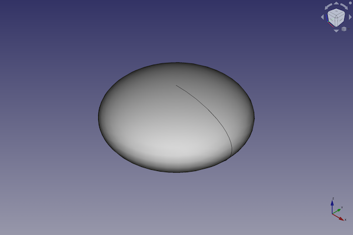
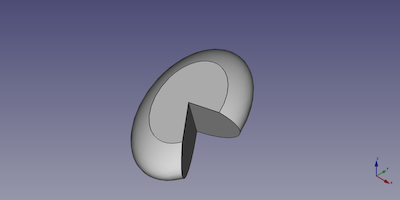

---
- GuiCommand:
   Name:Part Ellipsoid
   MenuLocation:Part → [Create primitives](Part_Primitives.md) → Ellipsoid
   Workbenches:[Part](Part_Workbench.md), [OpenSCAD](OpenSCAD_Workbench.md)
   SeeAlso:[Part Create primitives](Part_Primitives.md)
---

# Part Ellipsoid

## Description

The  [Part Ellipsoid](Part_Ellipsoid.md) command creates a parametric ellipsoid solid.

FreeCAD creates an ellipsoid, which will have a circle for any cross section parallel to the XY plane. The cross section parallel to the other two planes will be an ellipse.

By default, the ellipsoid is positioned with its mass center at the origin (0,0,0).



## Usage

1.  There are several ways to invoke the command:
    -   Press the ** [Create Primitives...](Part_Primitives.md)** button.
    -   Select the **Part → Create Primitives →  Create Primitives...** option from the menu.
    -   Select the ** Ellipsoid** option from the menu.
2.  Set options and press **Create**.
3.  To close the dialog press **Close**.

## Example



A Part Ellipsoid object with the values of the bottom scripting example are shown here.

## Notes

The shape produced is limited in FreeCAD to being a solid (optionally truncated) spheroid, the shape you would create by rotating an ellipse around one of its axis. By default it is a [Oblate Spheroid](http://en.wikipedia.org/wiki/Oblate_spheroid), the shape you would create by rotating an ellipse around its minor axis. The parameters can be changed to form a [Prolate Spheroid](http://en.wikipedia.org/wiki/Prolate_spheroid).

In mathematics, an [Ellipsoid](http://en.wikipedia.org/wiki/Ellipsoid) would have an elliptical cross section in all three planes.

## Properties

See also: [Property editor](Property_editor.md).

A Part Ellipsoid object is derived from a [Part Feature](Part_Feature.md) object and inherits all its properties. It also has the following additional properties:

### Data


{{TitleProperty|Ellipsoid}}

-    **Radius1|Length**: By default the minor radius parallel to the Z-axis,

-    **Radius2|Length**: By default the major radius parallel to the XY plane, it is also the maximum radius of the circular cross section

-    **Radius3|Length**: By default the major radius parallel to the YZ plane, it is also the maximum radius of the angular cross section

-    **Angle1|Angle**: Lower truncation of the ellipsoid, parallel to the circular cross section (-90 degrees in a full spheroid)

-    **Angle2|Angle**: Upper truncation of the ellipsoid, parallel to the circular cross section (90 degrees in a full spheroid)

-    **Angle3|Angle**: Angle of rotation of the elliptical cross section (360 degrees in a full spheroid)

## Scripting

A Part Ellipsoid is created with the {{Incode|addObject()}} method of the document.

 
```python
ellipsoid = FreeCAD.ActiveDocument.addObject("Part::Ellipsoid", "myEllipsoid")
```

-   Where {{Incode|myEllipsoid}} is the name for the object. The name must be unique for the entire document.
-   The function returns the newly created object.

The {{Incode|Label}} is the user editable name for the object. It can be easily changed by

 
```python 
ellipsoid.Label = "new myEllipsoidName"
```

You can access and modify attributes of the {{Incode|ellipsoid}} object. For example, you may wish to modify the three radii and the three angles of the ellipsoid.

 
```python
ellipsoid.Radius1 = 2
ellipsoid.Radius2 = 4
ellipsoid.Radius3 = 6
ellipsoid.Angle1 = -90
ellipsoid.Angle2 = 50
ellipsoid.Angle3 = 300
```

The result will be a part of an ellipsoid.

You can change its placement and orientation with:

 
```python
ellipsoid.Placement = FreeCAD.Placement(FreeCAD.Vector(1, 2, 3), FreeCAD.Rotation(15, 0, 20))
```


---
 [documentation index](../README.md) > [Part](Part_Workbench.md) > Part Ellipsoid
