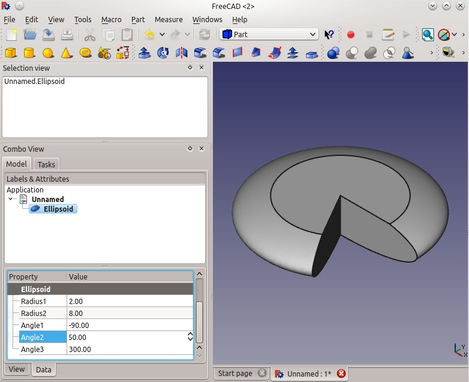

---
- GuiCommand:
   Name:Part Ellipsoid
   MenuLocation:Part → [Create primitives](Part_Primitives.md) → Ellipsoid
   Workbenches:[Part](Part_Workbench.md), [OpenSCAD](OpenSCAD_Workbench.md)
   SeeAlso:[Part Create primitives](Part_Primitives.md)
---

## Description

The  [Part Ellipsoid](Part_Ellipsoid.md) command creates a parametric Ellipsoid solid.

The shape produced is limited in FreeCAD to being a solid (optionally truncated) spheroid, the shape you would create by rotating an ellipse around one of its axis. By default it is a [Oblate Spheroid](http://en.wikipedia.org/wiki/Oblate_spheroid), the shape you would create by rotating an ellipse around its minor axis. The parameters can be changed to form a [Prolate Spheroid](http://en.wikipedia.org/wiki/Prolate_spheroid).

The default spheroid in FreeCAD will have a circle for any cross section parallel to the XY plane. The cross section parallel to the other two planes will be an ellipse.

In mathematics, an [Ellipsoid](http://en.wikipedia.org/wiki/Ellipsoid) would have an elliptical cross section in all three planes.

## Usage

A parametric Ellipsoid solid is available from the Create Primitives dialogue in the Part workbench.

1.  Switch to the  [Part Workbench](Part_Workbench.md)
2.  Access the Ellipsoid command several ways:
    -   Through the Create Primitives dialogue, pressing the  [Primitives](Part_Primitives.md) button located in the Part toolbar
    -   Using the {{MenuCommand|Part → [Create primitives](Part_Primitives.md) → Ellipsoid}} entry in the Part menu

## Properties

-   Radius 1, by default the minor radius parallel to the Z-axis,
-   Radius 2, by default the major radius parallel to the XY plane, it is also the maximum radius of the circular cross section
-   Angle 1, lower truncation of the ellipsoid, parallel to the circular cross section (-90 degrees in a full spheroid)
-   Angle 2, upper truncation of the ellipsoid, parallel to the circular cross section (90 degrees in a full spheroid)
-   Angle 3, angle of rotation of the elliptical cross section (360 degrees in a full spheroid)

  
