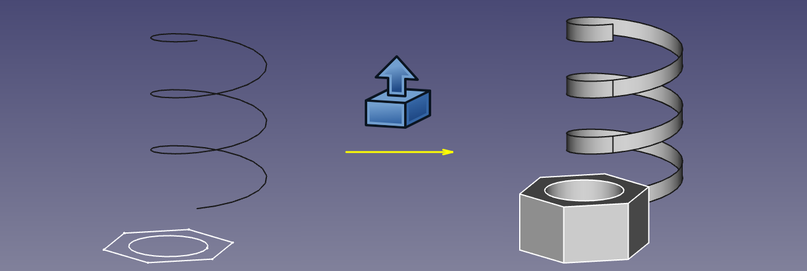
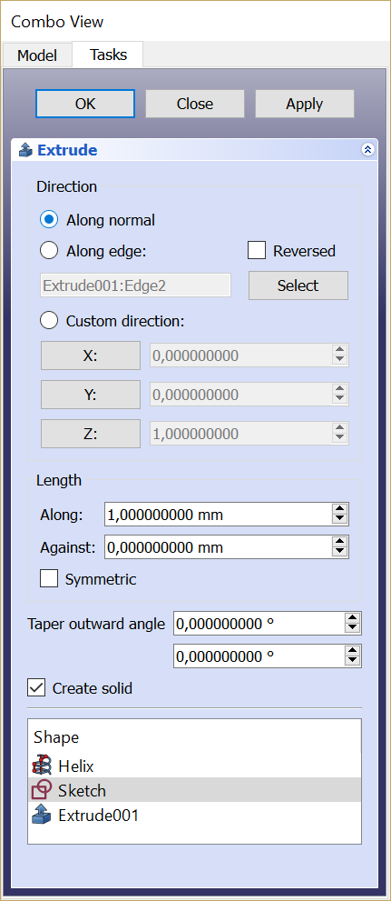

---
- GuiCommand:
   Name:Part Extrude
   MenuLocation:Part → Extrude
   Workbenches:[Part](Part_Workbench.md)
   SeeAlso:[Draft Trimex](Draft_Trimex.md), [PartDesign Pad](PartDesign_Pad.md)
---

# Part Extrude

## Description

**Part Extrude** extends a shape by a specified distance, in a specified direction. The output shape type will vary depending on the input shape type and the options selected.

In most common scenarios, the following lists the expected output shape type from a given input shape type,

-   Extrude a Vertex (point), will produce a lineal Edge (Line)
-   Extrude a open edge (e.g. line, arc), will produce a open face (e.g. plane)
-   Extrude a closed edge (e.g. circle), will optionally produce a closed face (e.g. an open ended cylinder) or if the parameter \"solid\" is \"true\" will produce a solid (e.g. a closed solid cylinder)
-   Extrude a open Wire (e.g. a Draft Wire), will produce a open shell (several joined faces)
-   Extrude a closed Wire (e.g. a Draft Wire), will optionally produce a shell (several joined faces) or if the parameter \"solid\" is \"true\" will produce a solid
-   Extrude a face (e.g. plane), will produce a solid (e.g. Cuboid)
-   Extrude a **[ [Draft ShapeString](Draft_ShapeString.md)**, will produce a compound of solids (the string is a compound of the letters which are each a solid)
-   Extrude a shell of faces, will produce a Compsolid.

  

*Examples of extrusion*

## Usage

1.  Select the shape(s) in the [3D view](3D_view.md) or in the Model [tree view](Tree_view.md)
2.  Click on the ** [Part Extrude](Part_Extrude.md)** button in the toolbar, or go to the **Part → Extrude** menu
3.  Set the direction and length and optionally other parameters (see the following [Parameters](#Parameters.md) section for more details).
4.  Click **OK**.

Alternatively, the selection can be done after launching the tool, by selecting one or more shape from the list in the [Tasks panel](Task_panel.md).

The Model tree will list as many Extrude objects as there were selected shapes. Each input shape is placed underneath its Extrude object.

## Parameters

The Extrude shape is defined by the following parameters, which can be edited after its creation in the [Property editor](Property_editor.md).

-   **Base**: the input shape (the shape upon which the Part Extrude was applied).

-   **Dir**: the direction to extend the shape. If **Dir Mode** is \'Custom\', you can edit **Dir**. Otherwise, **Dir** is read-only, and computed from the linked shape.

-   **Dir Link**: parametric link to an edge (line) that sets the direction of extrusion.

-   **Dir Mode**: sets how **Dir** is controlled. \'Custom\' means **Dir** is editable. \'Edge\' means Dir is obtained from an edge (line) linked by **Dir Link**. \'Normal\' means Dir is perpendicular to the plane of the input shape.

-   **Length Fwd**: The distance to extrude by. If both **Length Fwd** and **Length Rev** are zero, the length of **Dir** vector is used.

-   **Length Rev**: Additional length to extrude against **Dir**.

-   **Solid**: if True, extruding a closed edge or a closed wire will yield a solid. If False, a shell will result.

-   **Reversed**: reverses the extrusion to go against **Dir**.

-   **Symmetric**: if True, extrusion is centered at the input shape, and total length is **Length Fwd**. **Length Rev** is ignored.

-   **Taper Angle** and **Taper Angle Rev**: applies an angle to the extrusion, so that sides of the extrusion are drafted by the specified angle. Positive angle means the cross-section expands. **Taper Angle Rev** sets the taper for the reversed part of the extrusion (the part from **Length Rev**).
    -   
        <small>(v0.20)</small> 
        
        Inner structures receive the opposite taper angle. This is done to facilitate the design of molds and molded parts.

    -   
        {{VersionMinus|0.19}}
        
        Tapered extrusion is only supported for shapes without inner structures. Taper does not work well if the shape contains B-splines.

-   **Face Maker Class**: sets C++ class name of face making code, which is used when making solids from wires. This property is here mainly for maintaining backward compatibility. Do not touch, unless you know what you are doing.

-   **Placement**: the standard [placement](Placement.md) parameters.

-   **Label**: label to be shown in the Model [tree view](Tree_view.md) (not available on Extrude creation).

## Task dialog 

-    **OK**button creates the extrusion, and closes the dialog.

-    **Close**button closes dialog, without doing anything.

-    **Apply**button creates the extrusion, but does not close the dialog. You can then select another shape in the list on the bottom, and create more extrusions. Clicking **Apply** may times creates many extrusions.

-   \'Direction\' radio buttons: set the way extrusion direction is computed.

-    **Select**button: click it, and then pick an edge in [3D view](3D_view.md). That edge will appear in text field next to the button, in format \"ObjectName:EdgeN\". You can also type the link manually. Values X,Y,Z will be filled according to the edge direction.

-    **X**, **Y**, **Z** buttons: Click *x* button to set extrusion direction to +*x* axis. Click it again to set -*x* axis.

-    **X**, **Y**, **Z** input fields: set or display the direction vector of extrusion. If both lengths are zero, the length of this vector sets the length of extrusion, and values are always in mm, regardless of unit preferences.

-   Length fields: set length of extrusion. These input fields have unit support.

-   Symmetric: spreads out the extrusion into both directions, so that the profile remains in the middle.

-   Taper Outward Angle: positive angle means profile is expanded at other end of extrusion.

-   Create Solid checkbox: if checked, extruding a closed wire or edge will yield a solid. It is checked by default, if a closed wire was preselected before invoking Part Extrude.

-   Shape list: here you select, what shapes to extrude. If multiple objects are selected, multiple Extrude objects are created.

## Notes

-   [App Link](App_Link.md) objects linked to the appropriate object types and [App Part](App_Part.md) containers with the appropriate visible objects inside can also be used as profiles and to specify the direction. <small>(v0.20)</small> 

-   The task dialog does not offer a preview, yet. **Apply** will create an extrusion object every time you click it, which can be useful as preview; however, they will remain and yet another one will be created as you click **OK**. [Undo](Std_Undo.md) can be useful to clean them up before clicking **OK**.

## Comparison with PartDesign Pad 

[PartDesign Pad](PartDesign_Pad.md) is also an extrusion feature, but there are important differences:

-   Part Extrude always creates a standalone shape. PartDesign Pad fuses the extrusion result to the rest of the Body.
-   Part Extrude doesn\'t care where it is in model tree. PartDesign Pad can only live inside a [PartDesign Body](PartDesign_Body.md).
-   Part Extrude can extrude any object that has a Part geometry ([OpenCASCADE](OpenCASCADE.md) shape), except for solids and CompSolids.
-   Part Extrude can extrude individual faces of other objects. PartDesign Pad will only accept either Sketch or faces of PartDesign objects as a profile.

 {{Part_Tools_navi}}

---
 [documentation index](../README.md) > [Part](Part_Workbench.md) > Part Extrude
