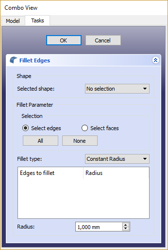

---
- GuiCommand:
   Name:Part Fillet
   MenuLocation:Part → Fillet
   Workbenches:[Part](Part_Workbench.md)
   SeeAlso:[Part Chamfer](Part_Chamfer.md)
---

## Description

This tool creates a fillet (round) on the selected edges of an object. A dialog allows you to choose which objects and which edges to work on.

## Usage

-   Start the tool from the Part toolbar or from the menu. You can either select the object before or after starting the tool.
-   If the shape was not selected prior to starting the tool, select it in the Shape drop down list in the [Task Panel](Task_panel.md).
-   Select the fillet type, either constant radius (default) or variable radius.
-   Select the edges either in the [3D view](3D_view.md), or by ticking them in the edge list in [Task Panel](Task_panel.md).
-   Set the radius value.
-   Click **OK** to validate.

## Part Fillet VS. PartDesign Fillet {#part_fillet_vs._partdesign_fillet}

There is another fillet tool in the  [PartDesign workbench](PartDesign_Workbench.md). Please note that their operation is quite different. Check out the  [PartDesign Fillet](PartDesign_Fillet.md) reference page for more details on their differences.

## Notes on application of Part Fillet {#notes_on_application_of_part_fillet}

Part Fillet might do nothing if the result would touch or cross the next adjacent edge. So if you do not get the expected result, try with a smaller value. This is the same for  [Part Chamfer](Part_Chamfer.md).

The fillet tool sometimes fails when trying to fillet complex objects. A common cause of this may be that the shape being filleted is not geometrically correct. This may be the result of lines/planes etc not being removed after previous operations used to construct the shape ( e.g. Cut/Intersection/Fusion). A number of steps can be used to minimize problems:

-   Where possible leave filleting a part until the part is completely generated. This will minimize interaction of fillets with subsequent Boolean operations;
-   Use the {{MenuCommand|Part → Check Geometry}} to check for any errors in the shape geometry and correct;
-   Use {{MenuCommand|Part → Refine shape}} to remove any artifacts introduced by previous Boolean operations before filleting (and in some cases between filleting operations in sequence);
-   Consider using {{MenuCommand|Edit → Preferences → PartDesign}} to enable automatic checking and refining of the model after Boolean and sketch based operations (performance may be affected if these options are left switched on).

Also note that the part Fillet feature is affected by the [Topological naming problem](Topological_naming_problem.md) when the any change is done to a modeling step earlier in the chain that affects the number of facets or vertices. This could cause unpredictable result. Until that is resolved (possibly with V0.19) it is advised to apply Chamfer and [Fillet](Part_Fillet.md) operations at the last steps in the chain.

   
