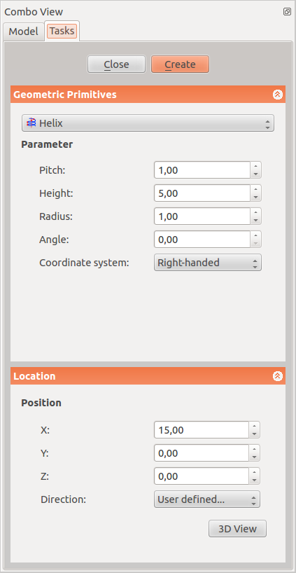
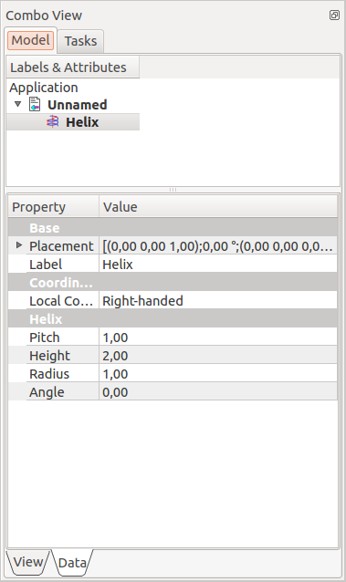

---
- GuiCommand:
   Name:Part Helix
   MenuLocation:Part → [Create primitives](Part_Primitives.md) → Helix
   Workbenches:[Part](Part_Workbench.md), [OpenSCAD](OpenSCAD_Workbench.md)
   SeeAlso:[Part Primitives](Part_Primitives.md)
---

## Description

The ** [Part Helix](Part_Helix.md)** geometric primitive creates a helix shape, defined by a radius, a pitch, and a total height.

A common usage for the helix primitive is for  [Sweep](Part_Sweep.md)** operation. This process works essentially the same in the [PartDesign Workbench](PartDesign_Workbench.md) by using the **[16px"> [PartDesign Additive pipe](PartDesign_AdditivePipe.md)** tool.

## Usage

1.  Switch to the  [Part Workbench](Part_Workbench.md).
2.  The Create Primitives dialogue can be accessed several ways:
    -   Pressing the ** [Primitives](Part_Primitives.md)** button located in the Part toolbar.
    -   Using the {{MenuCommand|Part →  [Create primitives](Part_Primitives.md) → Helix}} entry in the Part menu.

#### Parameter

-    {{Parameter|Pitch:}}The pitch corresponds to the space between two consecutive \"turns\" of the helix measured along the main axis of the helix.

-    {{Parameter|Height:}}The height corresponds to the overall height of the helix measured along the main axis of the helix.

-    {{Parameter|Radius:}}The radius corresponds to the radius of the circle built by the helix by viewing the helix from the top or bottom.

-    {{Parameter|Angle}}: Per default the helix is built on a imaginary cylinder. With this option it is possible to build the helix on a imaginary cone. This angle corresponds to the angle of the cone. The value must be comprised between 0 and +90 deg.

-    {{Parameter|Right-handed or Left-handed:}}This parameter specifies the [handedness](https://en.wikipedia.org/wiki/Screw_thread) of the helix.

#### Location

-    {{Parameter|X:}}The main axis of the helix will be translated along the x axis of the value you indicate in this field.

-    {{Parameter|Y:}}The main axis of the helix will be translated along the y axis of the value you indicate in this field.

-    {{Parameter|Z:}}The main axis of the helix will be translated along the z axis of the value you indicate in this field.

-    {{Parameter|Direction:}}Per default the main axis of the helix is the z axis. Here you have the possibility to edit the main axis of the helix. If you select the parameter \"user defined\...\" , you will be invited to indicate the main axis of the helix by entering the coordinates of its vector.

-    {{Parameter|3D View:}}allows you select center in the 3D view

## Options

### Properties

Once you have created the helix you have the possibility to edit its parameters.

+----------------------------------------------------------+----------------------------------------------------------------------------------+
|  | The parameters in this menu are similar to those described above.                |
|                                                          | **Base**                                                       |
|                                                          | \* {{Parameter|Placement:}} allows you to move or rotate the helix |
|                                                          |                                                                                  |
|                                                          | -                                                                 |
|                                                          |     {{Parameter|Angle:}}                                                         |
|                                                          |                                                                               |
+----------------------------------------------------------+----------------------------------------------------------------------------------+

  
