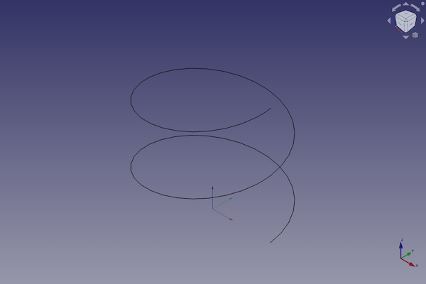
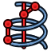
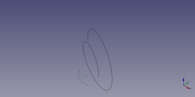

---
- GuiCommand:
   Name:Part Helix
   MenuLocation:Part → [Create primitives](Part_Primitives.md) → Helix
   Workbenches:[Part](Part_Workbench.md), [OpenSCAD](OpenSCAD_Workbench.md)
   SeeAlso:[Part Primitives](Part_Primitives.md)
---

# Part Helix

## Description

The  [Part Helix](Part_Helix.md) command creates a parametric helix shape.

FreeCAD creates a helix, with default values for pitch, height and radius. The shape angle can be set too.

By default, the rotation axis of the helix is is equal to the z-axis. The start point of the curve is on the x-axis. Its rotation is counterclockwise.



## Usage

1.  There are several ways to invoke the command:
    -   Press the ** [Create Primitives...](Part_Primitives.md)** button.
    -   Select the **Part → Create Primitives →  Create Primitives...** option from the menu.
    -   Select the ** Helix** option from the menu.
2.  Set options and press **Create**.
3.  To close the dialog press **Close**.

## Example



A Part Helix object with the values of the bottom scripting example are shown here.

## Notes

A common usage for the helix primitive is for [creating screw threads](Thread_for_Screw_Tutorial.md) in conjunction with a closed profile, and the ** [Sweep](Part_Sweep.md)** operation. This process works essentially the same in the [PartDesign Workbench](PartDesign_Workbench.md) by using the **[ [PartDesign Additive pipe](PartDesign_AdditivePipe.md)** tool.

## Properties

See also: [Property editor](Property_editor.md).

A Part Helix object is derived from a [Part Feature](Part_Feature.md) object and inherits all its properties. It also has the following additional properties:

### Data


{{TitleProperty|Coordinate System}}

-    **Local Coord**: The [handedness](https://en.wikipedia.org/wiki/Screw_thread) of the helix.


{{TitleProperty|Helix}}

-    **Pitch|Length**: The pitch corresponds to the space between two consecutive \"turns\" of the helix measured along the main axis of the helix.

-    **Height|Length**: The height corresponds to the overall height of the helix measured along the main axis of the helix.

-    **Radius|Length**: The radius corresponds to the radius of the circle built by the helix by viewing the helix from the top or bottom.

-    **Segment Length|Length**:

-    **Angle|Angle**: Per default the helix is built on a imaginary cylinder. With this option it is possible to build the helix on a imaginary cone. This angle corresponds to the angle of the cone. The value must be comprised between 0 and +90 deg.

## Scripting

A Part Helix is created with the {{Incode|addObject()}} method of the document.

 
```python
helix = FreeCAD.ActiveDocument.addObject("Part::Helix", "myHelix")
```

-   Where {{Incode|myHelix}} is the name for the object. The name must be unique for the entire document.
-   The function returns the newly created object.

The {{Incode|Label}} is the user editable name for the object. It can be easily changed by

 
```python 
helix.Label = "new myHelixName"
```

You can access and modify attributes of the {{Incode|helix}} object. For example, you may wish to modify the pitch, height and radius parameters.

 
```python
helix.Pitch = 2
helix.Height = 3
helix.Radius = 4
helix.SegmentLength = 21
helix.Angle = 45
```

You can change its placement and orientation with:

 
```python
helix.Placement = FreeCAD.Placement(FreeCAD.Vector(1, 2, 3), FreeCAD.Rotation(75, 60, 30))
```


---
 [documentation index](../README.md) > [Part](Part_Workbench.md) > Part Helix
