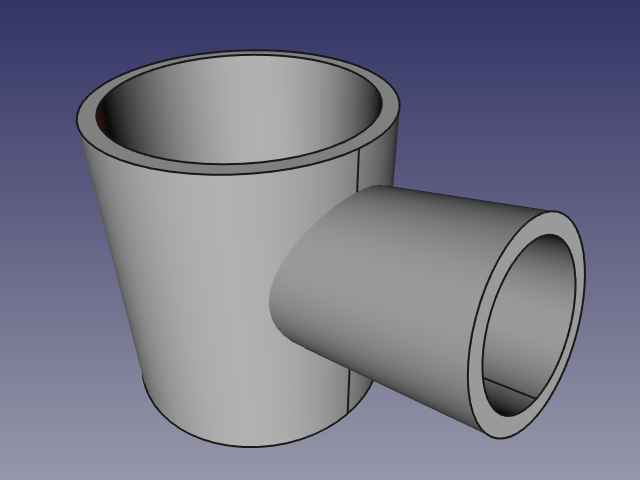
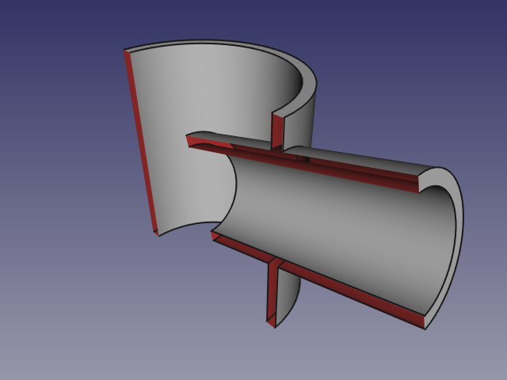

---
 GuiCommand:
   Name: Part JoinEmbed
   MenuLocation: Part , Join , Embed object
   Workbenches: Part_Workbench
   Version: 0.16
   SeeAlso: Part_JoinConnect, Part_JoinCutout, Part_Boolean, Part_Thickness
---

# Part JoinEmbed

## Description

The  **Part JoinEmbed** tool embeds a walled object (e.g. a pipe) into another walled object.

  

## Usage

1.  Select the base object first, then the object to be embedded. The order of selection is important. It is enough to select one sub-shape of each object (e.g. faces).
2.  There are several ways to invoke the tool:
    -   Press the ** [Embed object](Part_JoinEmbed.md)** button.
    -   Select the **Part → Join →  Embed object** option from the menu.
3.  A Part JoinFeature object is created, with Mode set to \'Embed\'. Original objects are hidden, and the result of embedding is shown in the [3D view](3D_view.md).

## Properties

{{TitleProperty|Base}}

-    **Base**: Reference to base object (the one the other object is to be embedded into). The object should be a single solid.

-    **Tool**: Reference to tool object (the object to be embedded). The object can be a single solid, or a [valid compound](Part_Compound.md) of solids.

-    **Mode**: The mode of operation, equals \'Embed\' (Changing that will transform the tool into another Part_JoinXXX). The value of \'bypass\' can be used to temporarily disable the long computations (a compound of Base and Tool will be created, which is a fast operation).

-    **Refine**: Sets whether to apply [Refine](Part_RefineShape.md) operation or not, to the final shape. The default value is determined by a \'Automatically refine shape after boolean operation\' checkbox in PartDesign preferences. When Mode property is \'bypass\', Refine is ignored (never applied).

## Example

1.  Create a pipe by applying [thickness](Part_Thickness.md) to a [cylinder](Part_Cylinder.md):
    
2.  Create another, smaller diameter pipe, and [place](Placement.md) it so that it pierces the wall of the first pipe:
    
3.  Select the first pipe, then the second pipe (order of selection is important), and click the \'Embed object\' option from the Join tools dropdown toolbar button.
    
4.  Use some cross-section tool ([Clipping plane](Std_ToggleClipPlane.md), [Arch Section Plane](Arch_SectionPlane.md), [Arch Cut Plane](Arch_CutPlane.md)) to reveal internals. On the picture below, Arch Section Plane is used.
    

## Algorithm

The algorithms behind Join tools are quite simple, and understanding them is important to use the tools correctly.

1\. Base object is [boolean-cut](Part_Cut.md) with Tool object. The resulting shape is a set ([compound](Part_Compound.md)) of non-intersecting solids (typically, two).

2\. The resulting compound is filtered: only the largest solid is kept.

3\. That largest solid is [boolean-fused](Part_Fuse.md) with Tool object.

4\. If Refine property is true, the resulting shape is [refined](Part_RefineShape.md).

### Notes

-   If after step 1, the object remains in one piece, the result of Embed will be equivalent to [union](Part_Fuse.md) of Base and Tool, but taking longer to compute.
-   Now, the tool will produce unexpected result, if a compound is supplied as Base. This may be changed in the future.
-   Because the largest piece is determined by comparing volumes of pieces, the tool can only work with solids. This may be changed in the future.

## Scripting

The Join tools can by used in [macros](macros.md) and from the python console by using the following function:

 

-   Creates an empty Embed feature (or other Join feature, depending on mode passed). The properties Base and Tool must be assigned explicitly, afterwards.
-   Returns the newly created object.

Example:

 {{code|code=
import JoinFeatures
j = JoinFeatures.makePartJoinFeature(name = 'Embed', mode = 'Embed' )
j.Base = FreeCADGui.Selection.getSelection()[0]
j.Tool = FreeCADGui.Selection.getSelection()[1]
}}

The tool itself is implemented in Python, see **/Mod/Part/JoinFeatures.py** ([Github link](https://github.com/FreeCAD/FreeCAD/blob/master/src/Mod/Part/JoinFeatures.py)) under where FreeCAD is installed.

---
⏵ [documentation index](../README.md) > [Part](Part_Workbench.md) > Part JoinEmbed
