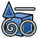
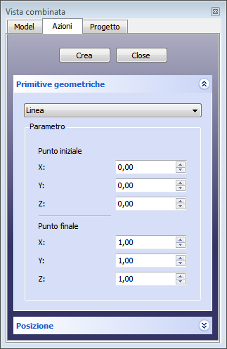
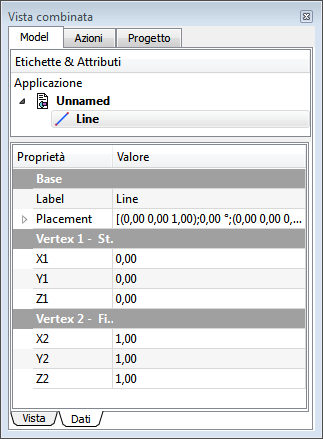

---
- GuiCommand:
   Name:Part Line
   MenuLocation:Part → [Create primitives](Part_Primitives.md) → Line
   Workbenches:[Part](Part_Workbench.md),  [OpenSCAD](OpenSCAD_Workbench.md)
   SeeAlso:[Part Primitives](Part_Primitives.md)
---

# Part Line

## Description

## Usage

1.  Switch to the  [Part Workbench](Part_Workbench.md)
2.  There are several ways to invoke the command:
    -   Press the ** [Primitives](Part_Primitives.md)** button.
    -   Select the **Part → [Create primitives...](Part_Primitives.md) → Line** from the menu bar.

### Geometric Primitives 

+++
|  | Line                          |
|                                                                          |                               |
|                                                                          | #### Parameter                |
|                                                                          |                               |
|                                                                          | :                             |
|                                                                          |                               |
|                                                                          | -              |
|                                                                          |     {{Parameter|Start point}} |
|                                                                          |                            |
|                                                                          |                               |
|                                                                          | -              |
|                                                                          |     {{Parameter|End point}}   |
|                                                                          |                            |
|                                                                          |                               |
|                                                                          | #### Location                 |
|                                                                          |                               |
|                                                                          | -                             |
|                                                                          | -                             |
+++

### Property

+++
|  | #### View                                |
|                                                        |                                          |
|                                                        | ..                                       |
|                                                        |                                          |
|                                                        | #### Data                                |
|                                                        |                                          |
|                                                        |                           |
|                                                        | **Base**                             |
|                                                        |                                       |
|                                                        | \* **Label**: |
|                                                        |                                          |
|                                                        | -                         |
|                                                        |     **Placement**           |
|                                                        |                                       |
|                                                        |     : [placement](Placement.md)  |
|                                                        |                                          |
|                                                        |                           |
|                                                        | **Vertex 1 Start**                   |
|                                                        |                                       |
|                                                        | \* **X1** :   |
|                                                        |                                          |
|                                                        | -                         |
|                                                        |     **X1**                  |
|                                                        |                                       |
|                                                        |     :                                    |
|                                                        |                                          |
|                                                        | -                         |
|                                                        |     **X1**                  |
|                                                        |                                       |
|                                                        |     :                                    |
|                                                        |                                          |
|                                                        |                           |
|                                                        | **Vertex 2 Finish**                  |
|                                                        |                                       |
|                                                        | \* **X2** :   |
|                                                        |                                          |
|                                                        | -                         |
|                                                        |     **X2**                  |
|                                                        |                                       |
|                                                        |     :                                    |
|                                                        |                                          |
|                                                        | -                         |
|                                                        |     **X2**                  |
|                                                        |                                       |
|                                                        |     :                                    |
+++


## Notes

## Properties

## Limitations

## Scripting

A Part Line can be created with the following function:

 
```python
line = FreeCAD.ActiveDocument.addObject("Part::Line", "myLine")
```

-   Where {{Incode|"myLine"}} is the name for the object.
-   The function returns the newly created object.

You can access and modify attributes of the {{Incode|line}} object.

The name of the object can be easily changed by

 
```python
line.Label = "new lineName"
```

For example, you may wish to modify the coordinates of the start and finish vertex.

 start vertex 
```python
line.X1 = 1
line.Y1 = 3
line.Z1 = 6
```

finish vertex 
```python
line.X2 = 2
line.Y2 = 3
line.Z2 = 9
```

The result will be a line.

You can change its placement and orientation with:

 
```python
line.Placement = FreeCAD.Placement(FreeCAD.Vector(2, 4, 6), FreeCAD.Rotation(30, 45, 10))
```


---
 [documentation index](../README.md) > [Part](Part_Workbench.md) > Part Line
