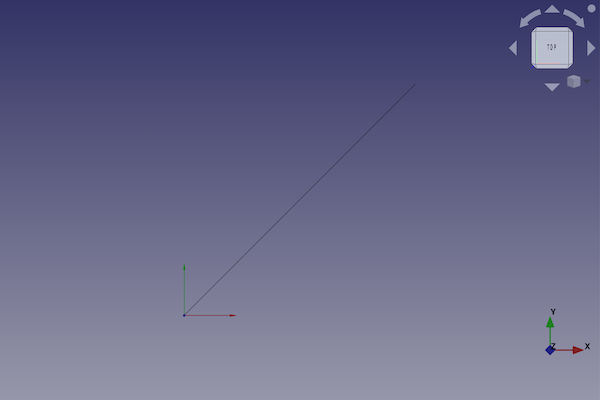

---
- GuiCommand:
   Name:Part Line
   MenuLocation:Part → [Create primitives](Part_Primitives.md) → Line
   Workbenches:[Part](Part_Workbench.md),  [OpenSCAD](OpenSCAD_Workbench.md)
   SeeAlso:[Part Primitives](Part_Primitives.md)
---

# Part Line

## Description

The  [Part Line](Part_Line.md) command creates a parametric line shape.

FreeCAD creates a line, with default values for the start and finish vertex.

By default, the line starts at the origin (0,0,0) and ends at the finish vertex position (10,10,10).



## Usage

1.  There are several ways to invoke the command:
    -   Press the ** [Create Primitives...](Part_Primitives.md)** button.
    -   Select the **Part → Create Primitives →  Create Primitives...** option from the menu.
    -   Select the ** Line** option from the menu.
2.  Set options and press **Create**.
3.  To close the dialog press **Close**.

## Example


A Part Line object with the values of the bottom scripting example are shown here.

## Properties

See also: [Property editor](Property_editor.md).

A Part Line object is derived from a [Part Feature](Part_Feature.md) object and inherits all its properties. It also has the following additional properties:

### Data


{{TitleProperty|Vertex 1 - Start}}

-    **X1|Float**: The x-coordinate of the vertex.

-    **Y1|Float**: The y-coordinate of the vertex.

-    **Z1|Float**: The z-coordinate of the vertex.


{{TitleProperty|Vertex 2 - Finish}}

-    **X2|Float**: The x-coordinate of the vertex.

-    **Y2|Float**: The y-coordinate of the vertex.

-    **Z2|Float**: The z-coordinate of the vertex.

## Scripting

A Part Line is created with the {{Incode|addObject()}} method of the document.

 
```python
line = FreeCAD.ActiveDocument.addObject("Part::Line", "myLine")
```

-   Where {{Incode|myLine}} is the name for the object.The name must be unique for the entire document.
-   The function returns the newly created object.

The {{Incode|Label}} is the user editable name for the object. It can be easily changed by

 
```python 
line.Label = "new myLineName"
```

You can access and modify attributes of the {{Incode|line}} object. For example, you may wish to modify the start and finish vertices.

 start vertex 
```python
line.X1 = 1
line.Y1 = 3
line.Z1 = 6
```

finish vertex 
```python
line.X2 = 2
line.Y2 = 3
line.Z2 = 9
```

You can change its placement and orientation with:

 
```python
line.Placement = FreeCAD.Placement(FreeCAD.Vector(2, 4, 6), FreeCAD.Rotation(30, 45, 10))
```


---
 [documentation index](../README.md) > [Part](Part_Workbench.md) > Part Line
