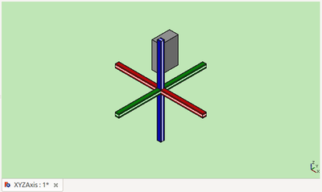
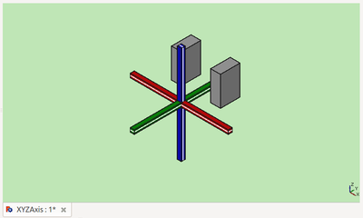
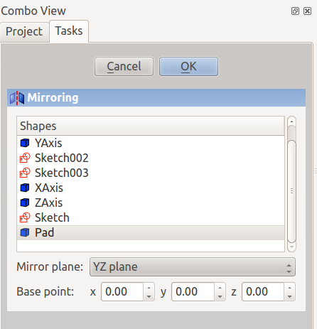

---
- GuiCommand:
   Name: Part Mirror
   MenuLocation: Part - Mirror
   Workbenches: [Part](Part_Workbench.md)
---

# Part Mirror

## Description

**Part Mirror** creates a new object (image) which is a reflection of the original object (source). The image object is created behind a mirror plane. The mirror plane may be standard plane (**XY**, **YZ**, or **XZ**), or any plane parallel to a standard plane.

An example:

  

## Usage

1.  Select the source object from the Mirroring Panel list.
2.  Select a standard **Mirror plane** from the dropdown menu.
3.  Press **OK** to create the image object.

 

## Options

The **Base point** boxes can be used to move the mirror plane parallel to the selected standard mirror plane. Only one of the **X**, **Y**, or **Z** boxes is effective for a given standard plane.

  Standard Plane   Base Point Box   Effect
    
  **XY**           **Z**            Move mirror plane along **Z** axis.
  **XY**           **X**, **Y**     No effect.
  **XZ**           **Y**            Move mirror plane along **Y** axis.
  **XZ**           **X**, **Z**     No effect.
  **YZ**           **X**            Move mirror plane along **X** axis.
  **YZ**           **Y**, **Z**     No effect.

## Notes

-   [App Link](App_Link.md) objects linked to the appropriate object types and [App Part](App_Part.md) containers with the appropriate visible objects inside can also be used as source objects. <small>(v0.20)</small> 
-   Arbitrary mirror planes (ie not parallel to a standard plane) are not supported.

---
⏵ [documentation index](../README.md) > [Part](Part_Workbench.md) > Part Mirror
