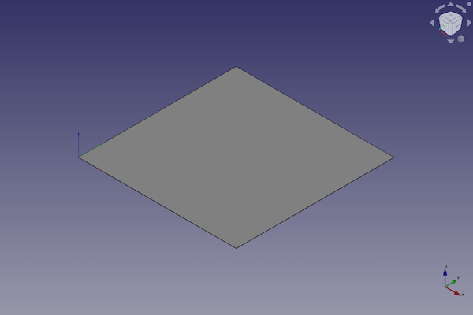
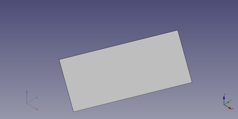

---
- GuiCommand:
   Name:Part Plane
   MenuLocation:Part → [Create primitives](Part_Primitives.md) → Plane
   Workbenches:[Part](Part_Workbench.md)
   SeeAlso:[Part Primitives](Part_Primitives.md)
---

# Part Plane

## Description

The  [Part Plane](Part_Plane.md) command creates a parametric plane.

FreeCAD creates a plane, each side with an equal length of 10 millimetre.

By default, the plane is positioned with the lower left corner at the origin (0,0,0) on the xy-plane.

  

## Usage

1.  There are several ways to invoke the command:
    -   Press the ** [Create Primitives...](Part_Primitives.md)** button.
    -   Select the **Part → Create Primitives →  Create Primitives...** option from the menu.
    -   Select the ** Plane** option from the menu.
2.  Set options and press **Create**.
3.  To close the dialog press **Close**.

## Example



A Part Plane object with the values of the bottom scripting example are shown here.

## Properties

### Data


{{TitleProperty|Plane}}

-    **Length|Length**: Length is the dimension along the X axis The default value is 10 mm

-    **Width|Length**: Width is the size of the Y-axis The default value is 10 mm

## Scripting

A Part Plane is created with the {{Incode|addObject()}} method of the document.

 
```python
plane = FreeCAD.ActiveDocument.addObject("Part::Plane", "myPlane")
```

-   Where {{Incode|myPlane}} is the name for the object. The name must be unique for the entire document.
-   The function returns the newly created object.

The {{Incode|Label}} is the user editable name for the object. It can be easily changed by

 
```python 
plane.Label = "new myPlaneName"
```

You can access and modify attributes of the {{Incode|plane}} object. For example, you may wish to modify the length and width parameters.

 
```python
plane.Length = 4
plane.Width = 8
```

You can change its placement with:

 
```python
plane.Placement = FreeCAD.Placement(FreeCAD.Vector(1, 2, 3), FreeCAD.Rotation(20, 75, 60))
```


---
 [documentation index](../README.md) > [Part](Part_Workbench.md) > Part Plane
