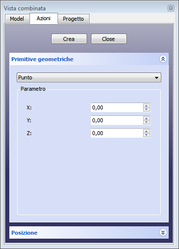
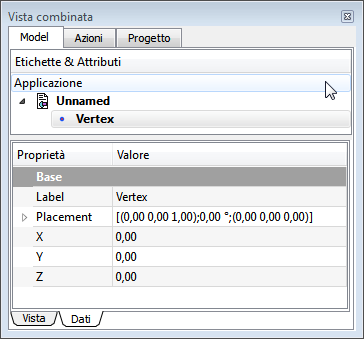

---
- GuiCommand:
   Name:Part Point
   MenuLocation:Part → [Create primitives](Part_Primitives.md) → Point
   Workbenches:[Part](Part_Workbench.md)
   SeeAlso:[Part Primitives](Part_Primitives.md)
---

# Part Point

## Description

A Point (vertex) geometric primitive.

## Usage

1.  Switch to the  [Part Workbench](Part_Workbench.md)
2.  The Create Primitives dialogue can be accessed several ways:
    -   Pressing the  [Primitives](Part_Primitives.md) icon located in the Part toolbar
    -   Using the **Part → [Create primitives](Part_Primitives.md) → Point** menu

### Geometric Primitives 

+++
|  | Point               |
|                                                                              |                     |
|                                                                              | #### Parameter      |
|                                                                              |                     |
|                                                                              | -    |
|                                                                              |     {{Parameter|X}} |
|                                                                              |                  |
|                                                                              |                     |
|                                                                              | -    |
|                                                                              |     {{Parameter|Y}} |
|                                                                              |                  |
|                                                                              |                     |
|                                                                              | -    |
|                                                                              |     {{Parameter|Z}} |
|                                                                              |                  |
|                                                                              |                     |
|                                                                              | #### Location       |
|                                                                              |                     |
|                                                                              | -                   |
|                                                                              | -                   |
|                                                                              | -                   |
+++

### Property

+++
|  | #### View                               |
|                                                            |                                         |
|                                                            | #### Data                               |
|                                                            |                                         |
|                                                            |                          |
|                                                            | **Base**                            |
|                                                            |                                      |
|                                                            | -                        |
|                                                            |     **Label**              |
|                                                            |                                      |
|                                                            |     :                                   |
|                                                            |                                         |
|                                                            | -                        |
|                                                            |     **Placement**          |
|                                                            |                                      |
|                                                            |     : [placement](Placement.md) |
|                                                            |                                         |
|                                                            | -                        |
|                                                            |     **X**                  |
|                                                            |                                      |
|                                                            |     :                                   |
|                                                            |                                         |
|                                                            | -                        |
|                                                            |     **Y**                  |
|                                                            |                                      |
|                                                            |     :                                   |
|                                                            |                                         |
|                                                            | -                        |
|                                                            |     **Z**                  |
|                                                            |                                      |
|                                                            |     :                                   |
+++

## Notes

## Properties

## Limitations

## Scripting

A Part Point can be created with the following function:

 
```python
point = FreeCAD.ActiveDocument.addObject("Part::Vertex", "myPoint")
```

-   Where {{Incode|"myPoint"}} is the name for the object.
-   The function returns the newly created object.

The name of the object can be easily changed by

 
```python
point.Label = "new pointName"
```

You can access and modify attributes of the {{Incode|point}} object. For example, you may wish to modify the x, y or z coordinate.

 
```python
point.X = 1
point.Y = 2
point.Z = 3
```

The result will be a new location of the point with the given coordinates.

You can change its placement and orientation with:

 
```python
point.Placement= FreeCAD.Placement(FreeCAD.Vector(0.00,0.00,0.00),App.Rotation(App.Vector(0.00,0.00,1.00),0.00))
```


 {{Part_Tools_navi}}


---
 [documentation index](../README.md) > [Part](Part_Workbench.md) > Part Point
