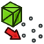

---
- GuiCommand:
   Name:Part PointsFromMesh‎
   MenuLocation:Part → Create points object from geometry
   Workbenches:[Part](Part_Workbench.md)
   Version:0.19
   SeeAlso:[Part ShapeFromMesh](Part_ShapeFromMesh.md), [Part ConvertToSolid](Part_MakeSolid.md), [Part RefineShape](Part_RefineShape.md)
---

# Part PointsFromMesh

## Description

The  [Part PointsFromMesh](Part_PointsFromMesh.md) tool creates a points object from a geometric object. In {{VersionMinus|0.20}} the base object must be a Mesh object, in later versions any geometric object can be selected.

The resulting shape is a compound of vertices, which can be used as reference to further create lines, sketches and faces with other tools, like those from the  [Sketcher](Sketcher_Workbench.md) or the  [Draft](Draft_Workbench.md) workbenches.

## Usage

1.  Select an object.
2.  Select the **Part →  Create points object from geometry** option from the menu.
3.  The **Distance in parameter space** dialog opens.
4.  Enter a distance value.
5.  Press the **OK** button.

---
 [documentation index](../README.md) > [Part](Part_Workbench.md) > Part PointsFromMesh
