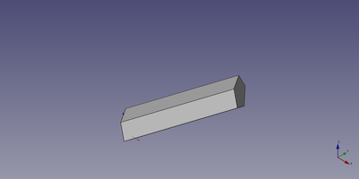

---
- GuiCommand:
   Name:Part Prism
   MenuLocation:Part → [Create primitives](Part_Primitives.md) → Prism
   Workbenches:[Part](Part_Workbench.md)
   Version:0.14
   SeeAlso:[Part Primitives](Part_Primitives.md), [Part Box/Cube](Part_Box.md)
---

# Part Prism

## Description

The  [Part Prism](Part_Prism.md) command creates a parametric prism solid.

FreeCAD creates a uniform hexagonal prism with a six-side polygon of equal edge length base with a circumradius of 2 millimetre and a height of 10 millimetre.

By default, the prism is positioned with the center of the base polygon at the origin (0,0,0). The bottom of the prism is on the xy-plane. Its extension in z-direction follows the positive axis value.


## Example

A Part Prism object with the values of the bottom scripting example are shown here.



## Usage

1.  There are several ways to invoke the command:
    -   Press the ** [Create Primitives...](Part_Primitives.md)** button.
    -   Select the **Part → Create Primitives →  Create Primitives...** option from the menu.
    -   Select the ** Prism** option from the menu.
2.  Set options and press **Create**.
3.  To close the dialog press **Close**.

## Properties

See also: [Property editor](Property_editor.md).

A Part Prism object is derived from a [Part Feature](Part_Feature.md) object and inherits all its properties. It also has the following additional properties:

### Data


{{TitleProperty|Prism}}

-    **Polygon|Integer**: The number of edges for the polygon that forms the base and top plane of the prism.

-    **Circumradius|Length**: The distance from the center of the polygon to the prism edges.

-    **Height|Length**: The height is the distance in the z-axis.

-    **First Angle|Angle**: Angle in first direction. <small>(v0.19)</small> 

-    **Second Angle|Angle**: Angle in second direction. <small>(v0.19)</small> 

## Scripting

A Part Prism is created with the {{Incode|addObject()}} method of the document.

 
```python
prism = FreeCAD.ActiveDocument.addObject("Part::Prism", "myPrism")
```

-   Where {{Incode|myPrism}} is the name for the object. The name must be unique for the entire document.
-   The function returns the newly created object.

The {{Incode|Label}} is the user editable name for the object. It can be easily changed by

 
```python
prism.Label = "new myPrismName"
```

You can access and modify attributes of the {{Incode|prism}} object. For example, you may wish to modify the number of sides of the base polygon, the circumferential radius or one of the two angles.

 
```python
prism.Polygon = 5
prism.Circumradius = 10
prism.Height = 50
prism.FirstAngle = 22.5
prism.SecondAngle = 45
```

The result will be a new prism with the given attributes.

You can change its placement and orientation with:

 
```python
prism.Placement = FreeCAD.Placement(FreeCAD.Vector(1, 2, 3), FreeCAD.Rotation(60, 75, 30))
```


---
 [documentation index](../README.md) > [Part](Part_Workbench.md) > Part Prism
