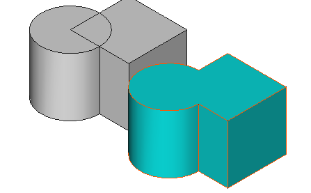

---
 GuiCommand:
   Name: Part RefineShape
   MenuLocation: Part , Create a copy , Refine Shape
   Workbenches: Part_Workbench
   SeeAlso: 
---

# Part RefineShape

## Description

The  **Part RefineShape** command creates parametric copies with a refined shape from selected objects. It removes unnecessary edges from planar and cylindrical faces.

   
*Original with 11 faces (left), and refined copy with 7 faces (right).*

## Usage

1.  Select one or more objects.
2.  Select the **Part → Create a copy →  Refine shape** option from the menu.
3.  For each object a cleaned, parametric copy is created
4.  The original objects are hidden.

## Notes

-   This command can be used as the last step in a traditional [constructive solid geometry](constructive_solid_geometry.md) workflow.
-   It may help to clean up the model before applying other features, such as [fillets](Part_Fillet.md).
-   Cleaning up an object may prevent 3D printers from printing unwanted edges once the object is exported to a mesh format.
-   This command can also be used after converting a mesh to a shape ([Part ShapeFromMesh](Part_ShapeFromMesh.md)).
-   By default this command creates parametric (linked) copies. There is [fine-tuning](Fine-tuning.md) parameter to change this to non-parametric copies. More information about parametric/non-parametric copy behavior can be found in this [forum post](https://forum.freecad.org/viewtopic.php?t=42993).
-   Some interesting information about what is happening with placement and how to access by Python can be found in this [forum post](https://forum.freecad.org/viewtopic.php?t=77568#p675456).

## Properties

See also: [Property editor](Property_editor.md).

A Part RefineShape object is derived from a [Part Feature](Part_Feature.md) object and inherits all its properties. It also has the following additional property:

### Data


{{TitleProperty|Refine}}

-    **Source|Link**: specifies the linked source shape.

## Scripting

The Python command for refining a shape is the following:

 
```python
shape.removeSplitter()
```


 {{Part_Tools_navi}}


---
⏵ [documentation index](../README.md) > [Part](Part_Workbench.md) > Part RefineShape
