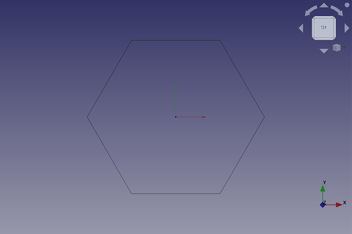
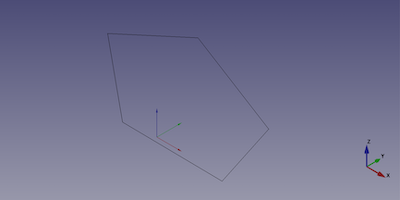

---
- GuiCommand:
   Name:Part RegularPolygon
   MenuLocation:Part → [Create primitives](Part_Primitives.md) → Regular Polygon
   Workbenches:[Part](Part_Workbench.md)
   Version:0.14
   SeeAlso:[Part Primitives](Part_Primitives.md)
---

# Part RegularPolygon

## Description

The  [Part Regular polygon](Part_RegularPolygon.md) command creates a parametric regular polygon shape.

FreeCAD creates a six-side polygon of equal edge length with a circumradius of 2 millimetre. By default, the polygon is positioned with its center at the origin (0,0,0) on the xy-plane.



## Usage

1.  There are several ways to invoke the command:
    -   Press the ** [Create Primitives...](Part_Primitives.md)** button.
    -   Select the **Part → Create Primitives →  Create Primitives...** option from the menu.
    -   Select the ** Regular polygon** option from the menu.
2.  Set options and press **Create**.
3.  To close the dialog press **Close**.

## Example



A Part Regular polygon object with the values of the bottom scripting example are shown here.

## Properties

See also: [Property editor](Property_editor.md).

A Part Regular polygon object is derived from a [Part Feature](Part_Feature.md) object and inherits all its properties. It also has the following additional properties:

### Data


{{TitleProperty|Regular Polygon}}

-    **Polygon|Integer**: The number of sides of the polygon which describes the cross section of the Part Prism

-    **Circumradius|Length**: The circumradius is the distance from the centre of the polygon to a vertex.

## Scripting

A Part Regular polygon is created with the {{Incode|addObject()}} method of the document.

 
```python
regularPolygon = FreeCAD.ActiveDocument.addObject("Part::RegularPolygon", "myRegularPolygon")
```

-   Where {{Incode|myRegularPolygon}} is the name for the object. The name must be unique for the entire document.
-   The function returns the newly created object.

The {{Incode|Label}} is the user editable name for the object. It can be easily changed by

 
```python 
regularPolygon.Label = "new myRegularPolygonName"
```

You can access and modify attributes of the {{Incode|regularPolygon}} object. For example, you may wish to modify the length, width and height parameters.

 
```python
regularPolygon.Polygon = 5
regularPolygon.Circumradius = 8
```

You can change its placement and orientation with:

 
```python
regularPolygon.Placement = FreeCAD.Placement(FreeCAD.Vector(1, 2, 3), FreeCAD.Rotation(60, 30, 15))
```


---
 [documentation index](../README.md) > [Part](Part_Workbench.md) > Part RegularPolygon
