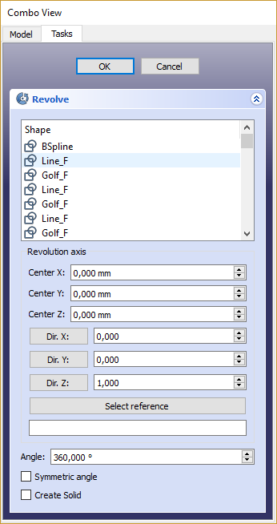

---
- GuiCommand:
   Name:Part Revolve
   MenuLocation:Part → Revolve
   Workbenches:[Part](Part_Workbench.md)
---

## Description

Revolves the selected object around a given axis. The following shape types are allowed, and lead to the listed output shapes ([See Notes for exceptions](#Notes.md)):

  Input shape   Output shape
  ------------- ----------------------------
  Vertex        Edge
  Edge          Face
  Wire          Shell
  Face          Solid
  Shell         Compound solid (Compsolid)

Solids or compound solids are not allowed as input shapes. Normal compounds are currently not allowed, too. Future versions will check the actual shape type of compound objects.

The Angle argument specifies how far the object is to be turned. The coordinates move the origin of the axis of revolving, relative to the origin of the coordinate system.

If you select a user defined axis, the numbers define the direction of the revolving axis with respect to the coordinate system: If the Z coordinate is 0 and the Y and X coordinate are non-zero, then the axis will lie in the X-Y-plane. Its angle is such that its tangent is the ratio of the given X and Y coordinates.

### Notes

-   If your version of FreeCAD has a check box for Solid in the Revolve dialog, you can make Solids from closed Wires and Edges.
-   If Revolve is performed using an axis that intersects the face to rotate, and you want to create a solid, the result might be invalid. This can happen for various reasons, self-intersection, direction, etc.

   
