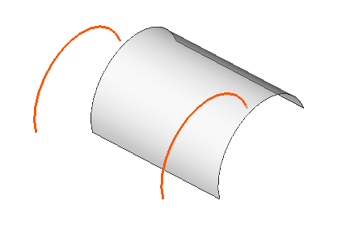

---
- GuiCommand:
   Name:Part RuledSurface
   MenuLocation:Part → RuledSurface
   Workbenches:[Part](Part_Workbench.md)
   SeeAlso:[Part MakeFace](Part_MakeFace.md)
---

# Part RuledSurface

## Description

Create ruled surface

  

## Usage

1.  Invoke the Ruled Surface command several waysː
    -   Press the  [Part RuledSurface](Part_RuledSurface.md) button
    -   Use the **Part → RuledSurface** entry in the Part menu

---
[documentation index](../README.md) > [Part](Part_Workbench.md) > Part RuledSurface
