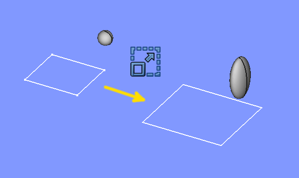
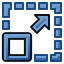
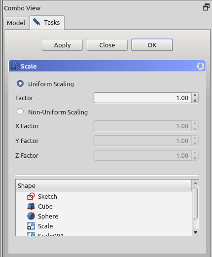

---
 GuiCommand:
   Name: Part Scale
   MenuLocation: Part , Scale...
   Workbenches: Part_Workbench
   Version: 0.22
   SeeAlso: Draft_Clone, Draft_Scale
---

# Part Scale

## Description

**Part Scale** scales shapes by a specified factor in all directions or by distinct factors in each cardinal direction. In the case of distinct factors, the shapes may be distorted.

   
*Examples of scaling*

## Usage

1.  Select one or more shapes in the [3D view](3D_view.md) or in the [Tree view](Tree_view.md).
2.  There are several ways to invoke the command:
    -   Press the ** [Scale...](Part_Scale.md)** button.
    -   Select the **Part →  Scale...** option from the menu.
3.  A [tasks panel](#Task_panel.md) opens.
4.  Choose **Uniform Scaling** or **Non-Uniform Scaling**.
5.  Set the scaling factor(s).
6.  Click **OK**.

Alternatively, the selection can be done after launching the command, by selecting one or more shapes from the list in the [tasks panel](#Task_panel.md).

The Tree view will list as many Scale objects as there were selected shapes. Each input shape is placed underneath its Scale object.

## Task panel 

  

-    **OK**button creates the scaled object, and closes the task panel.

-    **Close**button closes the task panel without doing anything.

-    **Apply**button creates the scaled objects, but does not close the task panel. You can then select another shape from the list at the bottom, and create more scaled objects.

-    **Shape**list: here you select which shapes to scale. If multiple shapes are selected, multiple Scale objects are created.

## Notes

-   Non-uniform scaling will turn all edges into B-spline curves, and all faces into B-spline surfaces. These are computationally heavier.
-   Points/Vertices can not be scaled as they are dimensionless.
-   [App Link](App_Link.md) objects linked to the appropriate object types and [App Part](App_Part.md) containers with the appropriate visible objects inside can also be scaled.
-   The task panel does not offer a preview yet. **Apply** will create a scaled object every time you click it, which can be useful as preview. They will however remain and yet another scaled object will be created as you click **OK**. [Undo](Std_Undo.md) can be useful to clean them up before clicking **OK**.

## Properties

See also: [Property editor](Property_editor.md).

A Part Scale object is derived from a [Part Feature](Part_Feature.md) object and inherits all its properties. It also has the following additional properties:

### Data

{{TitleProperty|Scale}}

-    **Base|Link**: The input shape (the shape upon which the Part Scale was applied).

-    **Uniform|Bool**: Controls uniform vs non-uniform scaling

-    **Uniform Scale|Float**: The scale factor for uniform scaling

-    **XScale|Float**: The X scale factor for non-uniform scaling.

-    **YScale|Float**: The Y scale factor, idem.

-    **ZScale|Float**: The Z scale factor, idem.

 {{Part_Tools_navi}}

---
⏵ [documentation index](../README.md) > [Part](Part_Workbench.md) > Part Scale
