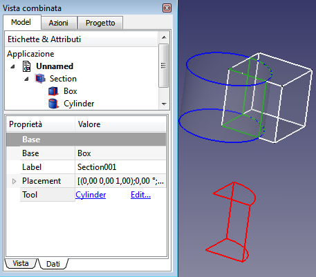

---
- GuiCommand   *
   Name   *Part Section
   MenuLocation   *Part → Section
   Workbenches   *[Part](Part_Workbench.md)
   SeeAlso   *[Part CrossSections](Part_CrossSections.md)
---

# Part Section

## Description

The [16px\|text-top=Section\|link=Part\_Section](Image   *Part_Section.svg.md) [Part Section](Part_Section.md) command creates wire geometry at the border between two intersecting objects. It adds a **Section** object to the document with its corresponding representation in the [Tree view](Tree_view.md).

-   An intersection of two solids/faces results in one or more section lines.
-   An intersection of two lines or a line and a solid/face results in one or more points.

This operation is fully parametric and thus the components can be modified and the result recomputed.

In this example, a cube is sectioned with a cylinder   *

+++
|  | -   **Base**   * base object, the Box       |
|                                                | -   **Tool**   * Section tool, the cylinder |
+++

Usually this would result in one closed set of section lines, but coplanar faces give some extra lines.

## Usage

1.  Select **two** objects. (This activates the related button and menu option)
2.  There are several ways to invoke the Section command   *
    -   Press the **_Section**_button.
    -   Select the **Part → _Section**_option_from_the_menu.

## Properties

See also   * [Property editor](Property_editor.md).

A PartDesign Chamfer object is derived from a [Part Feature](Part_Feature.md) object and inherits all its properties. It also has the following additional properties   *

### Data

{{Properties_Title|Base}}

-    **Base|Link**   * Link to the first (base) feature.

-    **Tool|Link**   * Link to the second (tool) feature.

{{Properties_Title|Boolean}}

-    **History|ShapeHistory|hidden**   * \"Shape history\".

-    **Refine|Bool**   * \"Refine shape (clean up redundant edges) after this boolean operation\". The default value is determined by the **Automatically refine model after sketch-based operation** preference. See [PartDesign Preferences](PartDesign_Preferences#General.md).

{{Properties_Title|Section}}

-    **Approximation|Bool**   * Approximation. Approximate the output edges.

## Links

To create sections with a section plane see  [Cross-sections](Part_CrossSections.md).

---
 [documentation index](../README.md) > [Part](Part_Workbench.md) > Part Section
