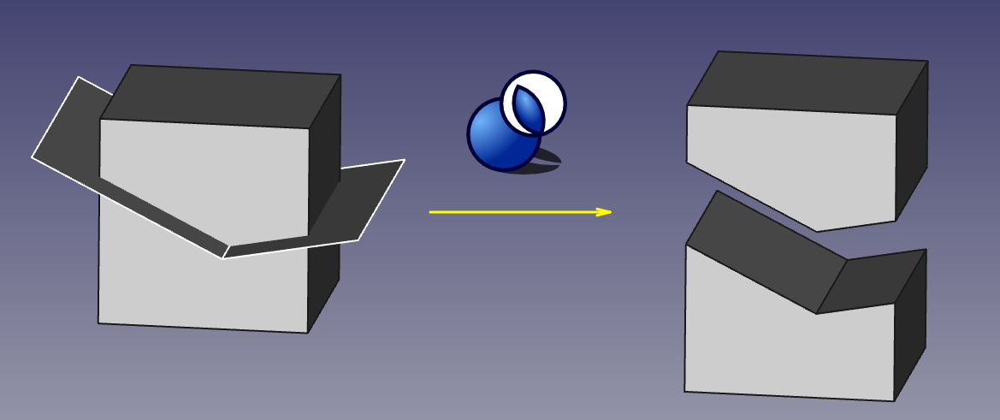
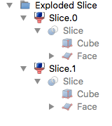

---
- GuiCommand:
   Name:Part SliceApart
   MenuLocation:Part → Split → Slice Apart
   Workbenches:[Part](Part_Workbench.md)
   Version:0.18
   SeeAlso:[Part Slice to compound](Part_Slice.md), [Part Explode Compound](Part_ExplodeCompound.md)
---

# Part SliceApart

## Description

Tool to split shapes by intersection with other shapes. For example, for a box and a plane, two solids are created.   

* Above: the pieces were moved apart manually afterwards, to reveal the slicing.*

[Slice apart](Part_SliceApart.md) is the same as  [Part Slice](Part_Slice.md) followed by  [Part Explode Compound](Part_ExplodeCompound.md). While \"Slice to compound\" is fully-parametric, and causes no trouble as the number of pieces changes, \"Slice apart\" will not update the number of objects as the number of pieces changes. They both create Slice parametric feature, that puts the sliced pieces into a compound, but \"Slice apart\" explodes the resulting compound into separate objects.

The output shape occupies the same space as the original. But it is split where it intersects with other shapes. The split pieces are individual pieces.

Please visit [Part Slice](Part_Slice.md) page for more info.

### Tree structure of Slice Apart 

The Slice Apart command creates more than only the sliced object. In the following example a cube is sliced by a face.

The slice is created and for each piece of it there is a [Part CompoundFilter](Part_CompoundFilter.md) created, thus the same slice occurs multiple times below each CompoundFilter. All these CompoundFilters are united in a Compound.

## Example

-   Making a puzzle: see [Part Slice](Part_Slice.md) example Steps 1 to 6

## Scripting

The tool can by used in [macros](macros.md) and from the python console by using the following function: 

`BOPTools.SplitFeatures.makeSlice(name)`

Set mode to **split** for slice apart

-   Creates an empty Slice feature. The \'Base\' and \'Tools\' properties must be assigned explicitly, afterwards.
-   Returns the newly created object.

Slice can also be applied to plain shapes, without the need to have a document object, via:   This can be useful for making custom Python scripted features.

Example:  {{code|code=
import BOPTools.SplitFeatures
j = BOPTools.SplitFeatures.makeSlice(name= 'Slice')
j.Base = FreeCADGui.Selection.getSelection()[0]
j.Tools = FreeCADGui.Selection.getSelection()[1:]
}}

The tool itself is implemented in Python, see {{FileName|/Mod/Part/BOPTools/SplitFeatures.py}} ([GitHub link](https://github.com/FreeCAD/FreeCAD/blob/master/src/Mod/Part/BOPTools/SplitFeatures.py)) within the FreeCAD installation directory.

## Notes

Slice Apart was introduced in FreeCAD v0.18.15506. FreeCAD needs to be compiled with OCC 6.9.0 or later; otherwise, the tool is unavailable.

## Video-Tutorials 

-   <https://www.youtube.com/watch?v=tzHkQaHgrfQ> : FreeCad 0.18 PART WB using SLICE and SLICE APART (English language), author: Ha Gei

-   <https://www.youtube.com/watch?v=JJAL5JmqqKQ> : FreeCAD Slice und Slice Apart und andere Tricks (German lanuage), author: Ha Gei

---
[documentation index](../README.md) > [Part](Part_Workbench.md) > Part SliceApart
