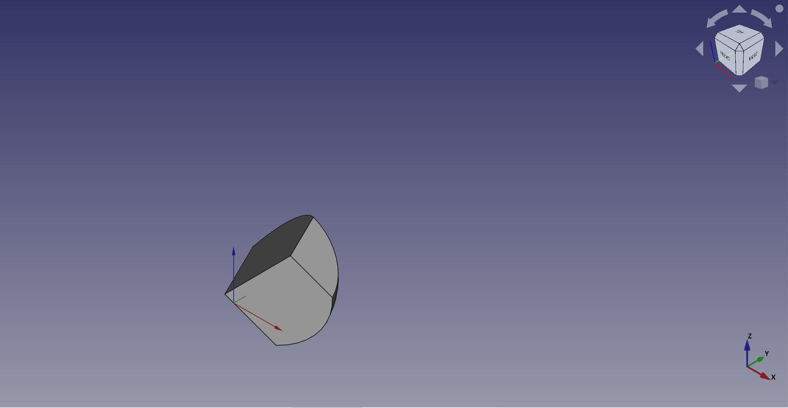

---
 GuiCommand:
   Name: Part Sphere
   MenuLocation: Part , Primitives , Sphere
   Workbenches: Part_Workbench
   SeeAlso: Part_Primitives
---

# Part Sphere

## Description

The  **Part Sphere** command creates a parametric sphere solid. It is the result of revolving a circular arc profile around an axis. In the coordinate system defined by its **Placement** property, the center of the sphere is positioned at the origin, and its axis of revolution is the Z axis.

A Part Sphere can be truncated at the top and/or bottom by changing its **Angle1** and/or **Angle2** properties. It can be turned into a segment of a sphere by changing its **Angle3** property.

  

## Usage

1.  There are several ways to invoke the command:
    -   Press the ** [Part Sphere](Part_Sphere.md)** button.
    -   Select the **Part → Primitives →  Sphere** option from the menu.
2.  The sphere is created.
3.  Optionally change the dimensions and **Placement** of the sphere by doing one of the following:
    -   Double-click the object in the [Tree view](Tree_view.md):
        1.  The **Geometric Primitives** task panel opens.
        2.  Change one or more properties.
        3.  The object is dynamically updated in the [3D view](3D_view.md).
        4.  Press the **OK** button.
    -   Change the properties in the [Property editor](Property_editor.md).
    -   Change the **Placement** with the  [Std TransformManip](Std_TransformManip.md) command.

## Example



A Part Sphere object created with the [scripting example](#Scripting.md) below is shown here.

## Notes

-   A Part Sphere can also be created with the  [Part Primitives](Part_Primitives.md) command. With that command you can specify the dimensions and placement at creation time.

## Properties

See also: [Property editor](Property_editor.md).

A Part Sphere object is derived from a [Part Feature](Part_Feature.md) object and inherits all its properties. It also has the following additional properties:

### Data


{{TitleProperty|Attachment}}

The object has the same attachment properties as a [Part Part2DObject](Part_Part2DObject#Data.md).


{{TitleProperty|Sphere}}

-    **Radius|Length**: The radius of the sphere. The default is {{Value|5mm}}.

-    **Angle1|Angle**: The start angle of the circular arc profile of the sphere. Valid range: {{Value|-90° &lt;&#61; value &lt;&#61; 90°}}. May not be equal to **Angle2**. The default is {{Value|-90°}}.

-    **Angle2|Angle**: The end angle of the circular arc profile of the sphere. Valid range: {{Value|-90° &lt;&#61; value &lt;&#61; 90°}}. May not be equal to **Angle1**. The default is {{Value|90°}}. If the total angle of the arc profile is smaller than {{Value|180°}} the sphere will be truncated and have a flat face at the top and/or bottom.

-    **Angle3|Angle**: The total angle of revolution of the sphere. Valid range: {{Value|0° &lt; value &lt;&#61; 360°}}. The default is {{Value|360°}}. If it is smaller than {{Value|360°}} the resulting solid will be a segment of a sphere.

## Scripting

See also: [Autogenerated API documentation](https://freecad.github.io/SourceDoc/), [Part scripting](Part_scripting.md) and [FreeCAD Scripting Basics](FreeCAD_Scripting_Basics.md).

A Part Sphere can be created with the {{Incode|addObject()}} method of the document:

 
```python
sphere = FreeCAD.ActiveDocument.addObject("Part::Sphere", "mySphere")
```

-   Where {{Incode|"mySphere"}} is the name for the object.
-   The function returns the newly created object.

Example:

 
```python
import FreeCAD as App

doc = App.activeDocument()

sphere = doc.addObject("Part::Sphere", "mySphere")
sphere.Radius = 20
sphere.Angle1 = -30
sphere.Angle2 = 45
sphere.Angle3 = 90
sphere.Placement = App.Placement(App.Vector(3, 9, 11), App.Rotation(75, 60, 30))

doc.recompute()
```


---
⏵ [documentation index](../README.md) > [Part](Part_Workbench.md) > Part Sphere
