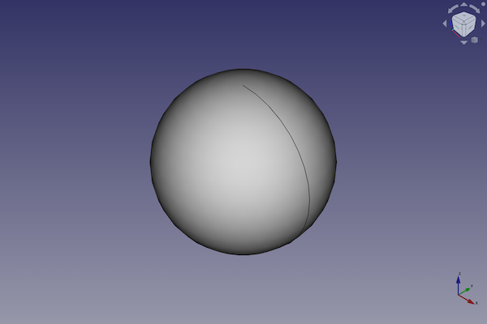

---
- GuiCommand:
   Name:Part Sphere
   MenuLocation:Part → Primitives → Sphere
   Workbenches:[Part](Part_Workbench.md)
   SeeAlso:[Part Primitives](Part_Primitives.md)
---

# Part Sphere

## Description

The  [Part Sphere](Part_Sphere.md) command creates a parametric sphere solid.

FreeCAD creates a sphere with a radius of 5 millimetre.

By default, the sphere is positioned with its center at the origin (0,0,0).

  

## Usage

1.  There are several ways to invoke the command:
    -   Press the ** [Sphere](Part_Sphere.md)** button.
    -   Select the **Part → Primitives →  Sphere** option from the menu.

## Example


A Part Sphere object with the values of the bottom scripting example are shown here.

## Notes

It is difficult to understand the meaning of the three angles.

A full filled sphere is defined by:

-   Angle 1 = -90°
-   Angle 2 = 90°
-   Angle 3 = 360°

If you increase or decrease these values, you will get a parted sphere.

Angle 1 is defined as the angle between the x and z axis. 0° is equal to the x axis. Negative values are equal to the -z direction.

Angle 2 is defined as the angle between the y and z axis. 0° is equal to the y axis. Positive values are equal to the z direction.

Angle 3 is defined as the angle between the x and y axis. 0° is equal to the x axis. The angle rotation is counterclockwise.

## Properties

See also: [Property editor](Property_editor.md).

A Part Sphere object is derived from a [Part Feature](Part_Feature.md) object and inherits all its properties. It also has the following additional properties:

### Data


{{TitleProperty|Sphere}}

-    **Radius|Length**: Radius of the sphere

-    **Angle1|Angle**: 1st angle to cut / define the sphere (angle between XZ axis)

-    **Angle2|Angle**: 2nd angle to cut / define the sphere (angle between YZ axis)

-    **Angle3|Angle**: 3rd angle to cut / define the sphere (angle between XY axis)

Because it is quite difficult to explain the meaning of the parameters angle 1, angle 2, angle 3, the picture below gives an explanation about these parameters with following values: angle 1 = -45°, angle 2 = 45° and angle 3= 90°.

  

## Limitations

If the Angle 1 and Angle 2 values are \'critical\' (e.g. both have a value of 45°), the sphere cutoffs are overlapping and the result is invisible.

## Scripting

A Part Sphere can be created using the following function:

 
```python
sphere = FreeCAD.ActiveDocument.addObject("Part::Sphere", "mySphere")
```

-   Where {{Incode|mySphere}} is the user editable name for the object.
-   The function returns the newly created object.

The label text of the object can be easily changed by

 
```python
sphere.Label = "new mySphereName"
```

You can access and modify attributes of the {{Incode|sphere}} object.

For example, you may wish to modify the radius or the three angles of the sphere.

 
```python
sphere.Radius = 20
sphere.Angle1 = -30
sphere.Angle2 = 45
sphere.Angle3 = 90
```

The result will be a part of a sphere, that looks like a piece of cake.

You can change its placement and orientation with:

 
```python
sphere.Placement = FreeCAD.Placement(FreeCAD.Vector(1, 2, 3), FreeCAD.Rotation(75, 60, 30))
```


---
 [documentation index](../README.md) > [Part](Part_Workbench.md) > Part Sphere
