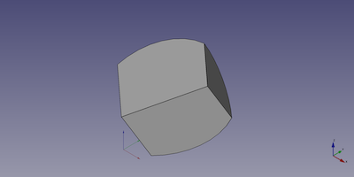

---
- GuiCommand:
   Name:Part Sphere
   MenuLocation:Part → Primitives → Sphere
   Workbenches:[Part](Part_Workbench.md)
   SeeAlso:[Part Primitives](Part_Primitives.md)
---

# Part Sphere

## Description

Creates a simple parametric sphere, with position, angle1, angle2, angle3 and radius parameters.

  

## Usage

1.  Switch to the  [Part Workbench](Part_Workbench.md)
2.  There are several ways to invoke the command:
    -   Press the ** Sphere** button in the toolbar.
    -   Select the **Part → Primitives →  Sphere** from the menu bar.

**Result:** The sphere will be positioned at origin (point 0,0,0) on creation. The angle parameters permit to make a portion of sphere instead of a full sphere (they are set to 360° by default).

The properties of the object can be edited, either in the [Property editor](Property_editor.md) or by double-clicking the object in the [Tree view](Tree_view.md).

## Notes

It is difficult to understand the meaning of the three angles.

A full filled sphere is defined by:

-   Angle 1 = -90°
-   Angle 2 = 90°
-   Angle 3 = 360°

If you increase or decrease these values, you will get a parted sphere.

Angle 1 is defined as the angle between the x and z axis. 0° is equal to the x axis. Negative values are equal to the -z direction.

Angle 2 is defined as the angle between the y and z axis. 0° is equal to the y axis. Positive values are equal to the z direction.

Angle 3 is defined as the angle between the x and y axis. 0° is equal to the x axis. The angle rotation is counterclockwise.

## Properties

### Data


{{TitleProperty|Sphere}}

-    **Radius:**Radius of the sphere

-    **Angle 1:**1st angle to cut / define the sphere (angle between xz axis)

-    **Angle 2:**2nd angle to cut / define the sphere (angle between yz axis)

-    **Angle 3:**3rd angle to cut / define the sphere (angle between xy axis)

Because it is quite difficult to explain the meaning of the parameters angle 1, angle 2, angle 3, the picture below gives an explanation about these parameters with following values: angle 1 = -45°, angle 2 = 45° and angle 3= 90°.

  

## Limitations

If the Angle 1 and Angle 2 values are \'critical\' (e.g. both have a value of 45°), the sphere cutoffs are overlapping and the result is invisible.

## Scripting

A Part Sphere can be created using the following function:

 
```python
sphere = FreeCAD.ActiveDocument.addObject("Part::Sphere", "mySphere")
```

-   Where {{Incode|"mySphere"}} is the name for the object.
-   The function returns the newly created object.

The name of the object can be easily changed by

 
```python
sphere.Label = "new sphereName"
```

You can access and modify attributes of the {{Incode|sphere}} object.

For example, you may wish to modify the radius or the three angles of the sphere.

 
```python
sphere.Radius = 20
sphere.Angle1 = -30
sphere.Angle2 = 45
sphere.Angle3 = 90
```

The result will be a part of a sphere, that looks like a piece of cake.

You can change its placement and orientation with:

 
```python
sphere.Placement = FreeCAD.Placement(FreeCAD.Vector(2, 4, 6), FreeCAD.Rotation(30, 45, 10))
```

The Part Sphere with the values of the scripting example looks like:




---
 [documentation index](../README.md) > [Part](Part_Workbench.md) > Part Sphere
