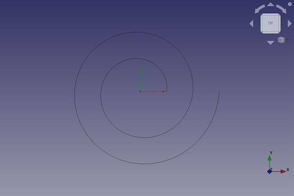
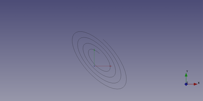

---
- GuiCommand:
   Name:Part Spiral
   MenuLocation:Part → [Create primitives](Part_Primitives.md) → Spiral
   Workbenches:[Part](Part_Workbench.md)
   Version:0.14
   SeeAlso:[Part Primitives](Part_Primitives.md)
---

# Part Spiral

## Description

The  [Part Spiral](Part_Spiral.md) command creates a parametric spiral shape.

FreeCAD creates a spiral, with default values for growth and radius. The number of rotations can be set too.

By default, the spiral is positioned with its start point on the x-axis with a distance of the radius from the origin (0,0,0). Its rotation is counterclockwise.



## Usage

1.  There are several ways to invoke the command:
    -   Press the ** [Create Primitives...](Part_Primitives.md)** button.
    -   Select the **Part → Create Primitives →  Create Primitives...** option from the menu.
    -   Select the ** Spiral** option from the menu.
2.  Set options and press **Create**.
3.  To close the dialog press **Close**.

## Example



A Part spiral object with the values of the bottom scripting example are shown here.

## Properties

See also: [Property editor](Property_editor.md).

A Part Spiral object is derived from a [Part Feature](Part_Feature.md) object and inherits all its properties. It also has the following additional properties:

### Data


{{TitleProperty|Spiral}}

-    **Growth|Length**: The growth of the spiral. This is the distance between the curves of the spiral.

-    **Radius|Length**: The radius of the spiral. This is the distance between the origin and the start point of the curve.

-    **Rotations|Float**: The number of full 360° rotations of the spiral. The rotation direction is counterclockwise.

-    **Segment Length|Float**: The segment length of the spiral.

## Scripting

A Part Spiral is created with the {{Incode|addObject()}} method of the document.

 
```python
spiral = FreeCAD.ActiveDocument.addObject("Part::Spiral", "mySpiral")
```

-   Where {{Incode|mySpiral}} is the name for the object. The name must be unique for the entire document.
-   The function returns the newly created object.

The {{Incode|Label}} is the user editable name for the object. It can be easily changed by

 
```python 
spiral.Label = "new mySpiralName"
```

You can access and modify attributes of the {{Incode|spiral}} object. For example, you may wish to modify the growth, radius and rotations parameters.

 
```python
spiral.Growth = 2
spiral.Radius = 3
spiral.Rotations = 4
```

You can change its placement and orientation with:

 
```python
spiral.Placement = FreeCAD.Placement(FreeCAD.Vector(1, 2, 3), FreeCAD.Rotation(75, 60, 30))
```


---
 [documentation index](../README.md) > [Part](Part_Workbench.md) > Part Spiral
