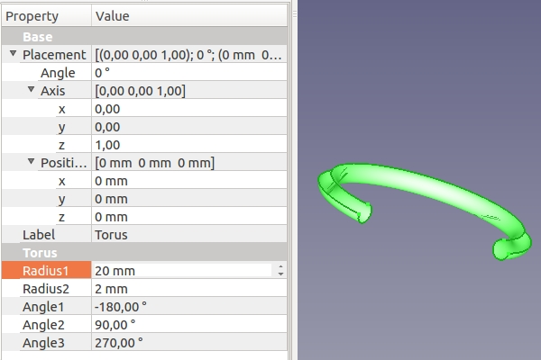
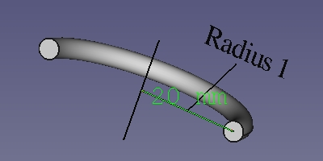
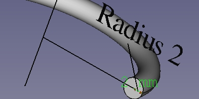
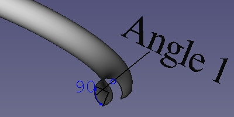
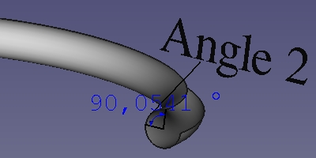
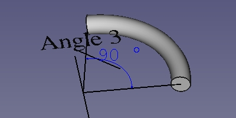

---
- GuiCommand:
   Name:Part Torus
   MenuLocation:Part → Primitives → Torus
   Workbenches:[Part](Part_Workbench.md)
   SeeAlso:[Part Primitives](Part_Primitives.md)
---

# Part Torus

## Description

Creates a simple parametric torus, with position, angle1, angle2, angle3, radius1 and radius2 as parameters.

  

## Usage

1.  Switch to the  [Part Workbench](Part_Workbench.md)
2.  There are several ways to invoke the command:
    -   Press the ** Torus** button in the toolbar.
    -   Select the **Part → Primitives →  Torus** from the menu bar.

**Result:** The torus will be positioned at origin (point 0,0,0) on creation.
The angle parameters (angle1, angle2, angle3), as well as the radius parameters (radius1, radius2) permit to parametrize the torus, see next section.

## Option

**Parameter**

A torus can be assimilated to a small disc that makes a circular orbit around an imaginary axe. Thus the parametric torus is defined by the following parameters:

-    {{Parameter|Radius1:}}Radius of the circle around which the disc circulate

-    {{Parameter|Radius2:}}Radius of the disc defining the form of the torus

-    {{Parameter|Angle1:}}1st angle to cut / define the disc of the torus

-    {{Parameter|Angle2:}}2nd angle to cut / define the disc of the torus

-    {{Parameter|Angle3:}}3rd angle to define the circumference of the torus.

as well as the standard set of placement parameters. The pictures below give a visual overview of the parameters antecedently mentioned:

 The parameter Radius1 has a value of 20 mm.

 The parameter Radius2 has a value of 2 mm.

 The parameter Angle1 has a value of -90°. Notice that, the \"angle measure\" tool cannot display negative angle. Considered the displayed value in picture as \"-90°\".

 The parameter Angle2 has a value of 90°.

 The parameter Angle3 has a value of 90°.

---
[documentation index](../README.md) > [Part](Part_Workbench.md) > Part Torus
