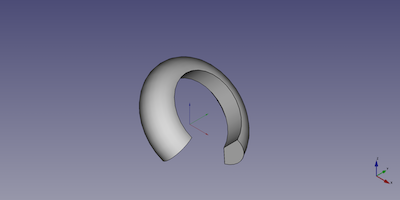

---
- GuiCommand:
   Name:Part Torus
   MenuLocation:Part → Primitives → Torus
   Workbenches:[Part](Part_Workbench.md)
   SeeAlso:[Part Primitives](Part_Primitives.md)
---

# Part Torus

## Description

The  [Part Torus](Part_Torus.md) command creates a parametric torus solid.

FreeCAD creates a torus, with a radius 1 of 2 millimetre and a radius 2 of 10 millimetre.

By default, the torus is positioned with its mass center at the origin (0,0,0).

  

## Usage

1.  There are several ways to invoke the command:
    -   Press the ** [Torus](Part_Torus.md)** button.
    -   Select the **Part → Primitives →  Torus** option from the menu.

## Example



A Part Torus object with the values of the bottom scripting example are shown here.

## Properties

See also: [Property editor](Property_editor.md).

A Part Torus object is derived from a [Part Feature](Part_Feature.md) object and inherits all its properties. It also has the following additional properties:

### Data


{{TitleProperty|Torus}}

-    **Radius1|Length**: Radius of the circle around which the disc circulate

-    **Radius2|Length**: Radius of the disc defining the form of the torus

-    **Angle1|Angle**: 1st angle to cut / define the disc of the torus

-    **Angle2|Angle**: 2nd angle to cut / define the disc of the torus

-    **Angle3|Angle**: 3rd angle to define the circumference of the torus.

## Scripting

A Part Torus can be created using the following function:

 
```python
torus = FreeCAD.ActiveDocument.addObject("Part::Torus", "myTorus")
```

-   Where {{Incode|myTorus}} is the user editable name for the object.
-   The function returns the newly created object.

The label text of the object can be easily changed by

 

You can access and modify attributes of the {{Incode|torus}} object. For example, you may wish to modify the radii or angle parameters.

 
```python
torus.Radius1 = 20
torus.Radius2 = 10
torus.Angle1 = -90
torus.Angle2 = 45
torus.Angle3 = 270
```

The result will be a three-quarter torus.

You can change its placement and orientation with:

 
```python
torus.Placement = FreeCAD.Placement(FreeCAD.Vector(1, 2, 3), FreeCAD.Rotation(30, 45, 10))
```


---
 [documentation index](../README.md) > [Part](Part_Workbench.md) > Part Torus
