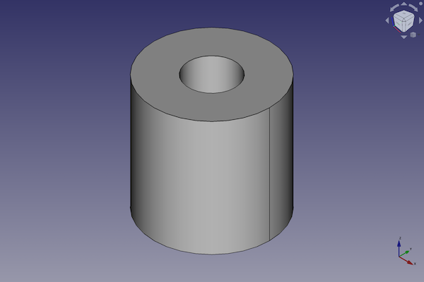
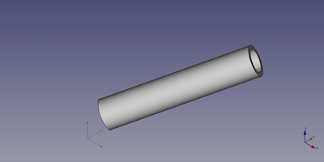

---
- GuiCommand:
   Name:Part Tube
   MenuLocation:Part → Primitives → Create tube
   Workbenches:[Part](Part_Workbench.md)
   Version:0.19
   SeeAlso:[Part CreatePrimitives](Part_CreatePrimitives.md)
---

# Part Tube

## Description

The  [Part Tube](Part_Tube.md) command creates a parametric tube solid.

FreeCAD creates a tube, with a inner radius of 2 millimetre, an outer radius of 5 millimetre and a height of 10 millimetre.

By default, the tube is positioned with the center of the bottom circles at the origin (0,0,0). The bottom of the tube is on the xy-plane. Its extension in z-direction follows the positive axis value.



## Usage

1.  There are several ways to invoke the command:
    -   Press the ** [Tube](Part_Tube.md)** button.
    -   Select the **Part → Primitives →  Tube** option from the menu.

## Example



A Part Tube object with the values of the bottom scripting example are shown here.

## Notes

The tube is geometrically treated as a cut of a smaller cylinder into a larger one.

## Properties

See also: [Property editor](Property_editor.md).

A Part Tube object is derived from a [Part Feature](Part_Feature.md) object and inherits all its properties. It also has the following additional properties:

### Data


{{TitleProperty|Tube}}

-    **Height|Length**: Sets the height (default is 10 mm).

-    **Inner Radius|Length**: Set the inner radius (default is 2 mm).

-    **Outer Radius|Length**: Set the outer radius (default is 5 mm).

## Scripting

A Part Tube can be created with the following code from the {{Incode|CommandShapes.py}} file:

 
```python
from BasicShapes import Shapes
from BasicShapes import ViewProviderShapes

tube = FreeCAD.ActiveDocument.addObject("Part::FeaturePython", "myTube")

Shapes.TubeFeature(tube)
ViewProviderShapes.ViewProviderTube(tube.ViewObject)
```

-   Where {{Incode|myTube}} is the name for the object. The name must be unique for the entire document.
-   The function returns the newly created object.

You have to [recompute](Std_Refresh.md) the current document with


```python
App.activeDocument().recompute(None,True,True)
```

to see the tube.

The {{Incode|Label}} is the user editable name for the object. It can be easily changed by

 
```python 
tube.Label = "new myTubeName"
```

You can access and modify attributes of the {{Incode|tube}} object. For example, you may wish to modify the length, width and height parameters.

 
```python
tube.Height = 20
tube.InnerRadius = 2
tube.OuterRadius = 3
```

You can change its placement with:

 
```python
tube.Placement = FreeCAD.Placement(FreeCAD.Vector(1, 2, 3), FreeCAD.Rotation(60, 60, 30))
```


---
 [documentation index](../README.md) > [Part](Part_Workbench.md) > Part Tube
