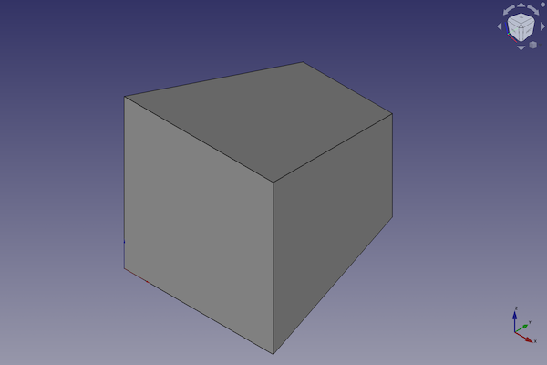
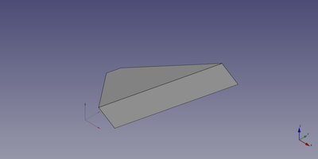

---
- GuiCommand:
   Name:Part Wedge
   MenuLocation:Part → Create primitives → Wedge
   Workbenches:[Part](Part_Workbench.md)
   SeeAlso:[Part Primitives](Part_Primitives.md)
---

# Part Wedge

## Description

The  [Part Wedge](Part_Wedge.md) command creates a parametric wedge solid.

FreeCAD creates a wedge, with a larger front square and a smaller back square.

By default, the wedge is positioned with the lower left corner at the origin (0,0,0). The front square of the wedge is on the xz-plane. Its extension in x, y and z direction follows the positive axis values.



## Usage

1.  There are several ways to invoke the command:
    -   Press the ** [Create Primitives...](Part_Primitives.md)** button.
    -   Select the **Part → Create Primitives →  Create Primitives...** option from the menu.
    -   Select the ** Wedge** option from the menu.
2.  Set options and press **Create**.
3.  To close the dialog press **Close**.

## Example



A Part Wedge object with the values of the bottom scripting example are shown here.

## Properties

See also: [Property editor](Property_editor.md).

A Part Wedge object is derived from a [Part Feature](Part_Feature.md) object and inherits all its properties. It also has the following additional properties:

### Data


{{TitleProperty|Wedge}}

-    **Xmin|Length**: Base face X minimum value

-    **Ymin|Length**: Wedge height minimum value

-    **Zmin|Length**: Base face Z minimum value

-    **X2min|Length**: Top face X minimum value

-    **Z2min|Length**: Top face Z minimum value

-    **Xmax|Length**: Base face X maximum value

-    **Ymax|Length**: Wedge height maximum value

-    **Zmax|Length**: Base face Z maximum value

-    **X2max|Length**: Top face X maximum value

-    **Z2max|Length**: Top face Z maximum value

## Scripting

A Part Wedge is created with the {{Incode|addObject()}} method of the document.

 
```python
wedge = FreeCAD.ActiveDocument.addObject("Part::Wedge", "myWedge")
```

-   Where {{Incode|myWedge}} is the name for the object. The name must be unique for the entire document.
-   The function returns the newly created object.

The {{Incode|Label}} is the user editable name for the object. It can be easily changed by

 
```python 
wedge.Label = "new myWedgeName"
```

You can access and modify attributes of the {{Incode|wedge}} object. For example, you may wish to modify the minimum or maximum coordinate parameters.

 
```python
wedge.Xmin = 1
wedge.Ymin = 2
wedge.Zmin = 3
wedge.X2min = 4
wedge.Z2min = 6
wedge.Xmax = 15
wedge.Ymax = 20
wedge.Zmax = 55
wedge.X2max = 10
wedge.Z2max = 12
```

You can change its placement and orientation with:

 
```python
wedge.Placement = FreeCAD.Placement(FreeCAD.Vector(1, 2, 3), FreeCAD.Rotation(75, 60, 30))
```


---
 [documentation index](../README.md) > [Part](Part_Workbench.md) > Part Wedge
