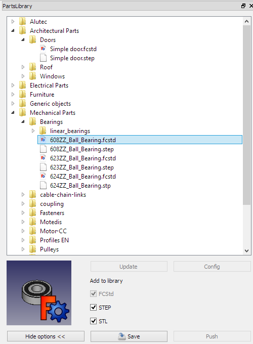

# Parts Library Workbench

 

## Introduction

 

This repository contains a library of Parts to be used in FreeCAD. It is maintained by the community of users of FreeCAD and is not part of the FreeCAD project, although it is made with the aim to be used as a repository of parts by FreeCAD in the future.

## References

-   Author: Initial commit yorikvanhavre + FreeCAD community
-   Home page: [FreeCAD library](https://github.com/FreeCAD/FreeCAD-library)
-   Source code on github: <https://github.com/FreeCAD/FreeCAD-library>

## Tools

Detailed description [here](http://www.bolts-library.org/en/docs/0.3/freecad/usage.html)

Parts Library Selector

  

## Installation

### Automatic installation 

This workbench can be installed from the [Addon Manager](Std_AddonMgr.md).

### From GitHub 

How to [here](https://github.com/FreeCAD/FreeCAD-library)

The library is a simple container for FreeCAD (.fcstd) and STEP (.stp) files. You can download it anywhere and import its files in your FreeCAD projects. Inside the library, there is also a FreeCAD macro (PartsLibrary.FCMacro) that you can place in your FreeCAD macros folder. That macro creates a browser window inside FreeCAD, from which you can easily add the parts by double-clicking them.

## Links to PartsLibrary workbench 

-   Workbench Wiki:
-   FreeCAD Wiki: [Macro PartsLibrary](http://www.freecadweb.org/wiki/index.php?title=Macro_PartsLibrary)
-   FreeCAD Forum: <http://forum.freecadweb.org/viewtopic.php?f=10&t=1378>
-   Tutorials:
-   Videos:
-   Files:
-   Parts list, Author and Standardisation bodies: [sharing your models from the macro](https://github.com/FreeCAD/FreeCAD-library#sharing-your-models-from-the-macro)
-   Report bugs: Please report bugs at <https://github.com/FreeCAD/FreeCAD-library/issues>

## Other useful links 

-   [BOLTS WB](http://www.freecadweb.org/wiki/index.php?title=Sandbox:Bolts)
-   [Fasteners WB](http://www.freecadweb.org/wiki/index.php?title=Sandbox:Fasteners)
-   [External workbenches](External_workbenches.md)
-   [Macros recipes](Macros_recipes.md)
-   [FreeCAD Download](Download.md)
-   [FreeCAD Community Portal](FreeCAD_Community_Portal.md)

 

[Category:User Documentation](Category:User_Documentation.md) [Category:Addons](Category:Addons.md) [Category:External Workbenches](Category:External_Workbenches.md)
